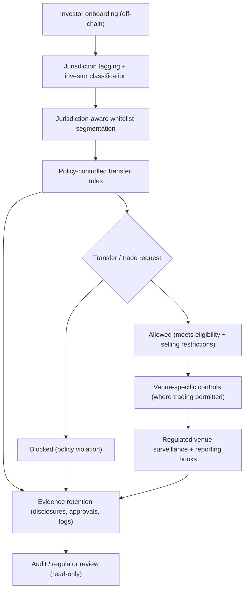

# Cross-Border Jurisdiction Controls (ASEAN Minimum)

This diagram illustrates how cross-border participation is managed via jurisdiction-aware policies, eligibility categories, and venue-specific controls. The goal is auditable compliance enforcement, not regulatory arbitrage.

