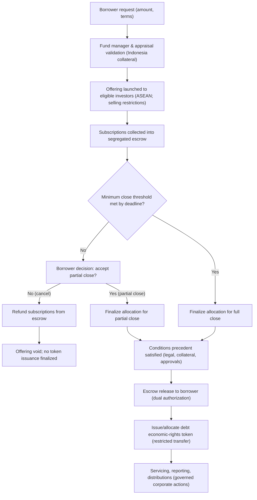

# Debt Offering Flow (Escrow + Closing Threshold)

This diagram illustrates a capital-light origination model where borrower drawdown depends on escrowed subscriptions meeting a documented close threshold. The token represents economic rights only; KYC/AML and eligibility are performed off-chain.

