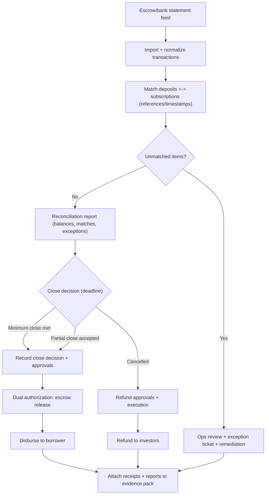

# Escrow Reconciliation Workflow (High-Level)

This diagram illustrates daily reconciliation and close-day controls for escrow-based offerings. It is designed to support auditability and investor protection (accurate allocations, timely refunds, and controlled releases).

