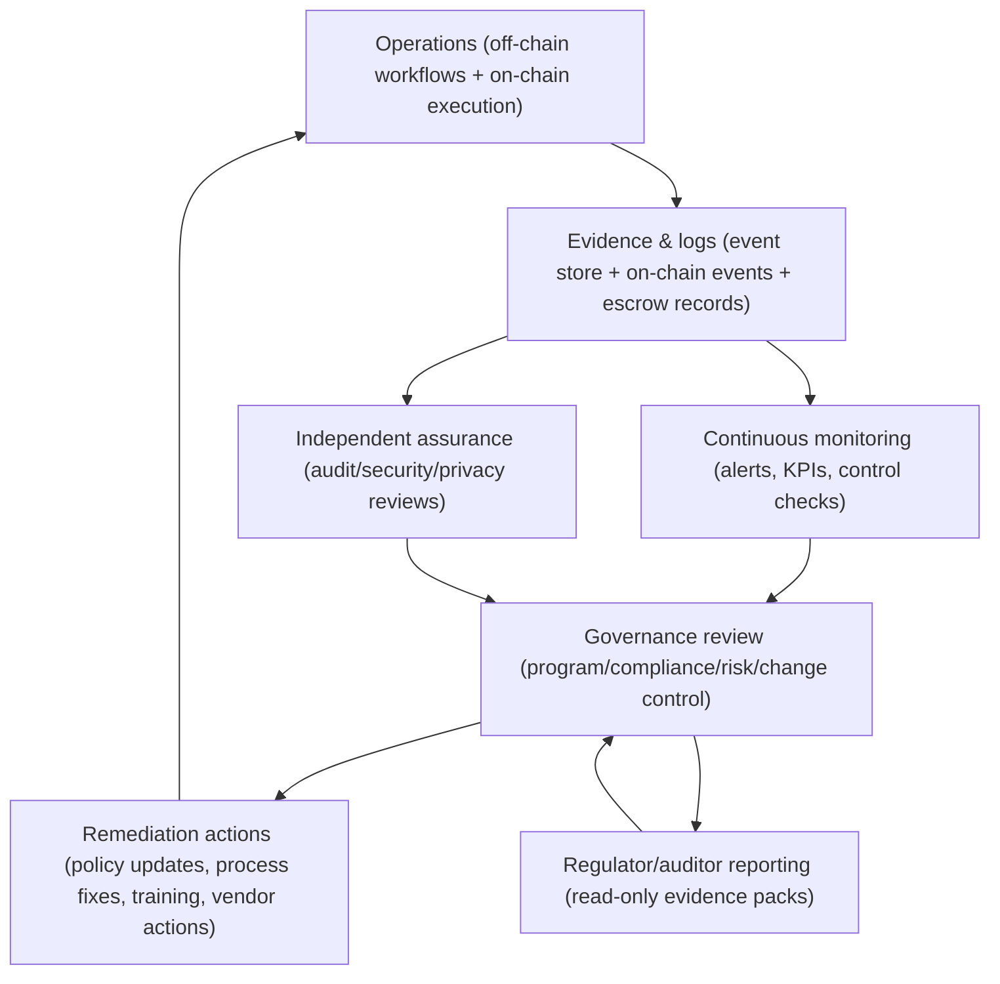

# Governance, Audit, and Monitoring Loop (High-Level)

This diagram shows how monitoring signals and audit evidence feed governance decisions and control improvements in a hybrid compliance architecture.

