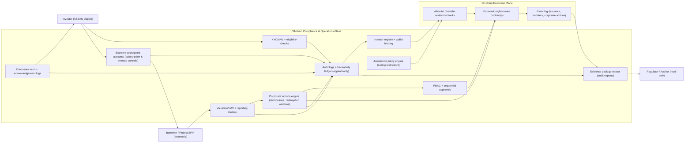

# Hybrid Compliance Architecture (High-Level)

This diagram shows the hybrid on-chain/off-chain compliance architecture used in this program. Personal data and regulated compliance operations remain off-chain; on-chain components focus on controlled execution and tamper-evident event logs.

