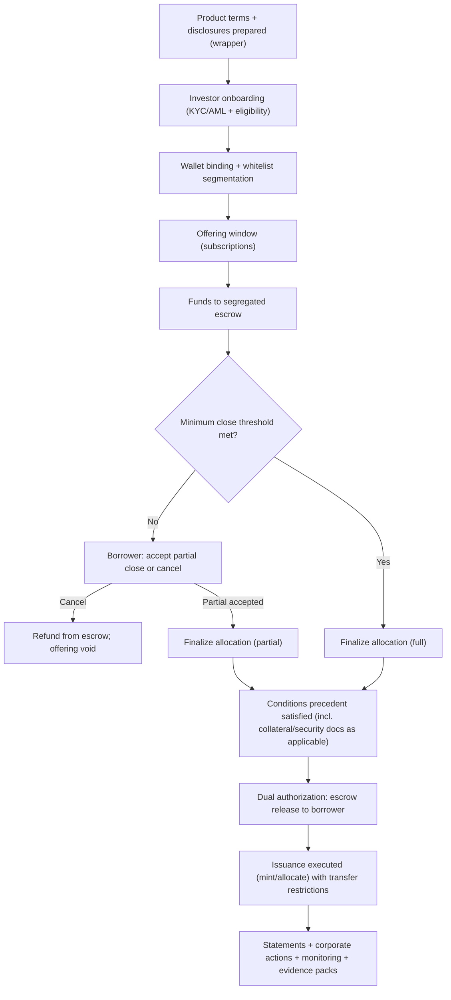

# Issuance Lifecycle (High-Level)

This diagram summarizes the issuance lifecycle for an escrow-based offering with close thresholds and restricted token issuance.

```mermaid
flowchart TD
  A["Product terms + disclosures prepared (wrapper)"] --> B["Investor onboarding (KYC/AML + eligibility)"]
  B --> C["Wallet binding + whitelist segmentation"]
  C --> D["Offering window (subscriptions)"]
  D --> E["Funds to segregated escrow"]
  E --> F{"Minimum close threshold met?"}

  F -- "No" --> G["Borrower: accept partial close or cancel"]
  G -- "Cancel" --> H["Refund from escrow; offering void"]

  G -- "Partial accepted" --> I["Finalize allocation (partial)"]
  F -- "Yes" --> J["Finalize allocation (full)"]

  I --> K["Conditions precedent satisfied (incl. collateral/security docs as applicable)"]
  J --> K
  K --> L["Dual authorization: escrow release to borrower"]
  L --> M["Issuance executed (mint/allocate) with transfer restrictions"]
  M --> N["Statements + corporate actions + monitoring + evidence packs"]
```
