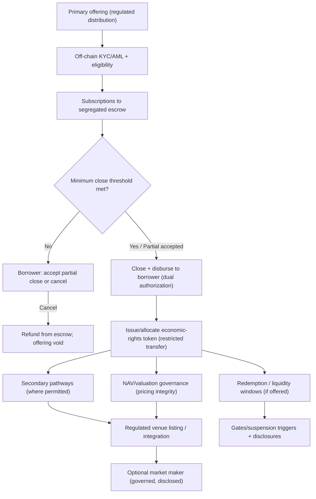

# Liquidity Engineering Map (Not Automatic Liquidity)

This diagram shows the engineered liquidity pathways: primary-market closing mechanics (including escrow + close threshold for debt), regulated venue strategy, optional market making, NAV reference governance, and documented redemption mechanisms (if offered).

