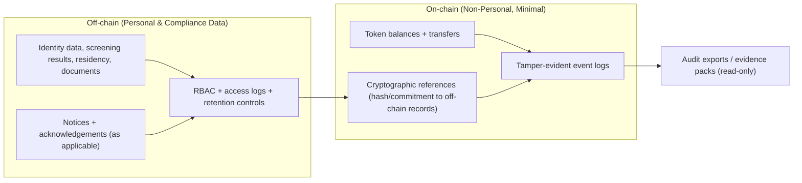

# Privacy Data Boundary (UU PDP / PDPA)

This diagram summarizes the privacy boundary: personal data stays off-chain under controlled access; on-chain stores only minimal operational events and cryptographic references for integrity.

