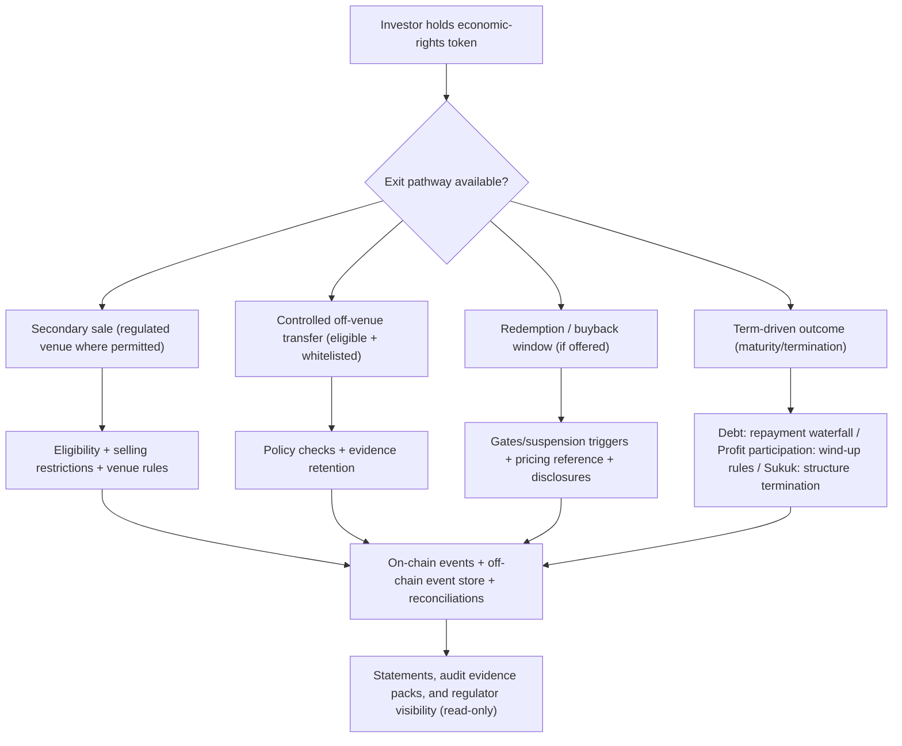

# Secondary Market and Exit Pathways (High-Level)

This diagram summarizes how investors may exit within a regulated, hybrid compliance framework. Secondary trading is venue-specific and not an assurance of liquidity; term-driven outcomes (e.g., maturity repayment) remain primary for many debt-like exposures.

