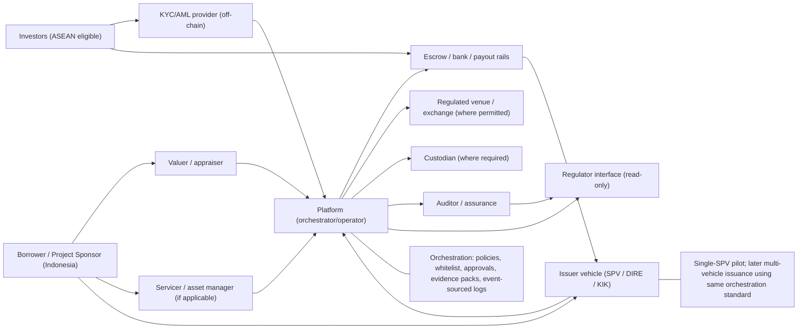

# Stakeholder and Operating Model (High-Level)

This diagram summarizes key stakeholders and interactions in the program. It reflects a single-SPV pilot that can later scale to multi-vehicle issuance under one standardized orchestration/control plane. The platform is positioned as an operator/orchestrator, not a regulator.

