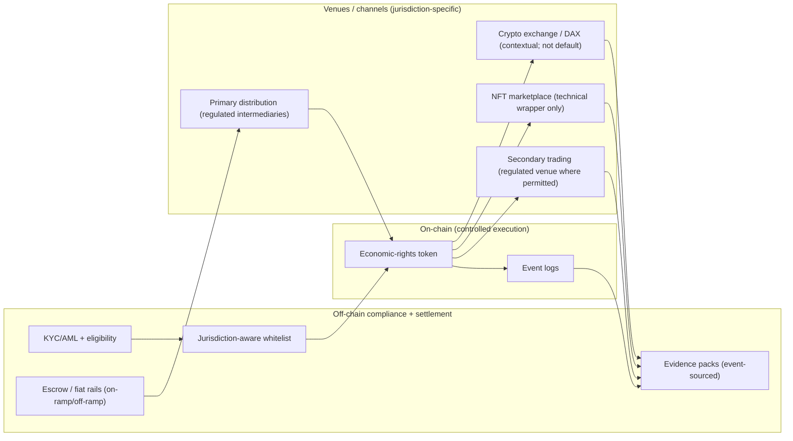

# Venues and Fiat Ramps (High-Level Overview)

This diagram summarizes how regulated venues and fiat on/off ramps relate to the economic-rights token lifecycle. It highlights that NFTs or crypto exchange rails do not change the regulatory perimeter of the economic rights represented.

