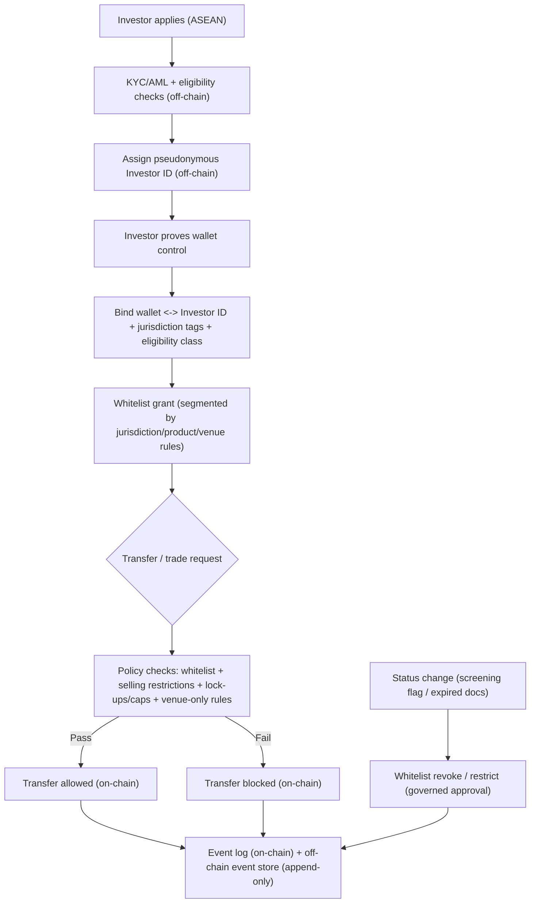

# Whitelist, KYC, and Identity Flow (Off-Chain Control Plane)

This diagram shows the compliance flow for onboarding, wallet binding, whitelist segmentation, and transfer decisioning. KYC/AML and personal data handling remain off-chain; on-chain stores only non-personal eligibility signals and event logs.

