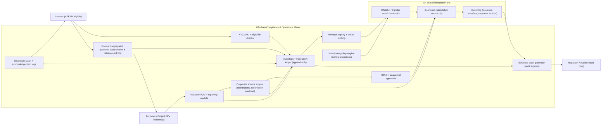
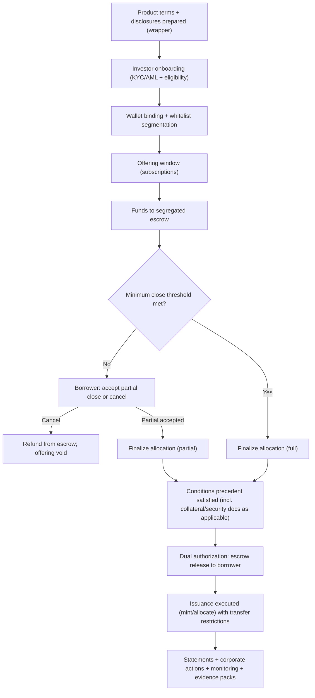

# Architecture (Hybrid On-Chain / Off-Chain Compliance)

## Architecture Objectives

The architecture is designed to support regulated issuance and lifecycle administration of tokens representing **economic rights only** for Indonesian underlying real estate exposures, with ASEAN-minimum cross-border participation. The system is explicitly **compliance-enabling**.

Reference diagram: `02-figures/diagrams/hybrid-compliance-architecture.md`.

This whitepaper assumes scale is achieved through **multiple issuance vehicles** (e.g., multi-SPV or series/compartment structures) under Indonesian jurisdiction, with the platform operating a common compliance control plane rather than concentrating all exposures into a single vehicle. For the pilot stage, a single-SPV deployment can be used to validate the orchestration and evidence model before expanding to multiple vehicles.

## Why a Hybrid Blockchain Architecture?

This framework uses blockchain selectively to strengthen traceability and control outcomes within a regulated operating model.

### Tamper-Evident Audit Trail

The program uses **EventDB Core as an offline integrity database** for the authoritative audit trail. EventDB Core provides append-only Event recording, hash-linked Chain continuity, accountable signatures, and periodic Seal checkpoints. On-chain event logs act as a **secondary reference surface** for issuance and transfer execution. This reduces ambiguity during audits and dispute resolution by providing consistent, verifiable references that can be reconciled against off-chain evidence.

### Enforceable Transfer Restrictions

Transfer restrictions are enforced through a combination of off-chain eligibility decisions and on-chain execution controls. The result is that resale and transfer rules (whitelists, lock-ups, venue-only rules where used) can be enforced consistently, with traceable outcomes (allowed/blocked) and governed exception handling.

### Cross-Border Consistency (ASEAN Minimum)

ASEAN participation requires jurisdiction-aware rules and controlled channels. A hybrid architecture supports consistent enforcement patterns across jurisdictions and venues while allowing jurisdiction-specific policy sets to be activated gradually during phased rollout.

### Evidence Portability

Because issuers, distributors, venues, auditors, and regulators may need to review evidence, the model emphasizes portable evidence packs. On-chain references and event logs support evidence portability by providing stable, verifiable anchors that can be shared without disclosing personal data on-chain.

### High-Level Architecture (Visual)

Primary objectives:

- Enforce jurisdiction-aware eligibility and selling restrictions
- Maintain an accurate, auditable investor register and transfer history
- Enable controlled automation for corporate actions (distributions, redemptions)
- Preserve privacy by keeping personal data off-chain
- Support regulator-oriented reporting and supervision interfaces

## Design Constraints (Non-Negotiables)

- **Hybrid model mandatory:** critical compliance functions remain off-chain.
- **KYC/AML always off-chain:** identity verification and screening are not performed on-chain.
- **Personal data not stored on-chain:** on-chain stores only minimal references for integrity/audit.
- **Jurisdiction-aware whitelist required:** cross-border transfers are policy-controlled.
- **No permissionless DeFi:** distribution and secondary trading are through regulated pathways.

## System Components

### Off-Chain Components (Compliance and Operations)

- **EventDB Core audit ledger (append-only, offline):** the off-chain operational layer uses EventDB Core to maintain an append-only Event history capturing onboarding, eligibility decisions, disclosures, approvals, allocations, escrow status changes, corporate actions, and reconciliations. EventDB Core enforces hash-linked Chain continuity, accountable signing, and Seal checkpoints to support deterministic evidence packs, investigations, and audits.
- **Investor onboarding and KYC/AML service:** identity verification, screening, ongoing monitoring.
- **Eligibility engine:** jurisdiction-aware rules (investor type, residency, selling restrictions).
- **Investor registry / transfer agent module:** authoritative register mapping investors to permitted wallet addresses.
- **Document and disclosure vault:** offering docs, investor notices, certificates, versioned disclosures.
- **Corporate actions engine:** schedules and executes distributions, redemptions, notices, and approvals.
- **Fiat settlement and ramp integration (escrow plane):** segregated escrow accounts, controlled releases (dual authorization), refunds, and payout rails; supports local currency constraints (e.g., Rupiah settlement for Indonesian flows) and cross-border collection via regulated intermediaries.
  - Pilot default: Indonesian escrow and domestic settlement rails (Indonesia-first distribution and evidence validation).
  - Cross-border extension: add jurisdiction-specific collection/payout partners and, where required, local escrow arrangements without weakening approvals, evidence retention, or reconciliation discipline.
- **Valuation and reporting module:** NAV inputs, periodic statements, audit exports.
- **Audit and regulator reporting interface:** read-only reports, event logs, and evidence packages.

Off-chain policies enforced by these components are derived from documented legal/compliance requirements (including jurisdiction- and venue-specific rules). They are versioned, approved, and auditable; they are not discretionary “platform rules”.

### On-Chain Components (Controlled Execution and Auditability)

- **Token contract(s):** represent economic rights; implement transfer restrictions and lifecycle events.
- **Policy hooks:** whitelist checks, jurisdiction tags, and configurable transfer controls.
- **Corporate action functions:** controlled distribution/redemption triggers (subject to RBAC and approvals).
- **Event log:** tamper-evident record of key lifecycle events and policy outcomes.

## Roles, Controls, and Authorization Model

The architecture uses RBAC and sequential approvals for privileged actions. Illustrative roles:

- **Issuer admin:** proposes issuance and corporate actions (no unilateral execution).
- **Compliance officer:** approves eligibility rules, whitelists, and restricted actions.
- **Operations / transfer agent:** executes reconciliations, registry maintenance, and statements.
- **Custodian / wallet admin (where applicable):** manages custody policies and access.
- **Auditor / regulator viewer:** read-only visibility into logs and evidence packages.

### Sequential Approval Pattern (Illustrative)

Critical actions (e.g., mint/issue, corporate action execution, emergency freeze) follow a controlled sequence:

1. Proposal created (off-chain workflow with evidence attachments)
2. Compliance review and approval (off-chain, logged)
3. On-chain execution enabled (time-bound, scope-bound)
4. Execution performed (on-chain transaction)
5. Post-event reconciliation and reporting (off-chain + on-chain event references)

## Token Lifecycle and Control Points

### 1) Onboarding and Wallet Binding (Off-Chain)

- Investor completes KYC/AML and eligibility assessment off-chain.
- Approved investors are assigned one or more permitted wallet addresses.
- The whitelist is updated through a governed workflow with audit logs.

Reference diagram: `02-figures/diagrams/issuance-lifecycle.md`.

## Whitelist, KYC, and Identity Controls (Off-Chain)

This framework uses off-chain identity and eligibility verification to support jurisdiction-aware transfer controls without storing personal data on-chain. The whitelist is treated as a compliance control mechanism, not a convenience feature.

Reference diagram: `02-figures/diagrams/whitelist-kyc-identity-flow.md`.

### Identity and KYC/AML (Off-Chain)

Identity verification and KYC/AML are performed off-chain, including (as applicable):

- identity proofing and document validation
- beneficial ownership and control checks for entities
- sanctions/PEP screening and risk-based due diligence
- ongoing monitoring and periodic refresh

Off-chain systems assign an internal, pseudonymous investor identifier for recordkeeping. Personal data remains off-chain under UU PDP/PDPA-aligned access controls and retention policies.

### Wallet Binding (Proof of Control)

Because on-chain transfers are executed by wallets, the operating model binds verified investors to one or more permitted wallet addresses:

- investor completes KYC/AML and eligibility assessment
- investor proves control of a wallet address (method defined by the operator and documented)
- the wallet is bound to the investor’s off-chain identity record and eligibility/jurisdiction tags
- wallet additions/removals are governed as controlled changes with audit trails

### Jurisdiction-Aware Whitelist Segmentation

Whitelist entries are segmented by:

- jurisdiction tags (investor jurisdiction, distribution jurisdiction, venue jurisdiction as applicable)
- investor eligibility category (e.g., institutional/eligible categories; capped retail where permitted)
- product constraints (debt/profit participation/sukuk/crowdfunding) and any lock-ups or resale limits

### Transfer Decisioning and Exceptions

Transfers (including venue-mediated trades where permitted) are allowed only if policy checks pass, typically requiring:

- sender and receiver wallets are whitelisted; and
- the transfer does not violate selling restrictions, lock-ups, caps, or venue-only rules.

If an investor status changes (e.g., screening flags, expired documents), whitelist privileges can be revoked or restricted through governed enforcement actions (e.g., hold/freeze), with auditable rationale.

### Auditability (Event-Sourced Evidence)

Whitelist and identity decisions are logged as append-only events in the off-chain event store (e.g., onboarding approved, eligibility class set, wallet bound, whitelist granted/revoked, transfer blocked with reason). This supports deterministic reconstruction of registers and evidence packs for audits and regulator inquiries.

### 2) Issuance and Subscription

- Subscriptions are accepted through regulated channels and documented.
- Issuance (minting) occurs only after approvals and receipt confirmation processes.
- On-chain issuance events reference off-chain documentation identifiers (integrity references only).

### 3) Transfers and Secondary Trading (Controlled)

Transfers are permitted only when:

- both sender and receiver wallet addresses are whitelisted; and
- the transfer complies with jurisdiction-specific selling restrictions and investor classification rules.

Where secondary trading is permitted, venue integration applies additional controls (venue onboarding, surveillance, trading rules).

### 4) Corporate Actions (Distributions and Redemptions)

Corporate actions are executed through controlled workflows:

- distribution schedules and entitlements are calculated off-chain
- execution is triggered on-chain only after approvals
- results are reconciled and evidenced through statements and audit exports

### 5) Exceptions and Enforcement

The system supports enforcement actions under governed conditions:

- freeze/hold actions (e.g., sanctions, dispute, court/regulator instructions)
- clawback or reversal logic only if legally supported and disclosed (otherwise avoided)
- incident response workflows with evidence preservation

## Data Model and Privacy Boundary

The architecture separates:

- **Personal and compliance data (off-chain):** identity data, screening outcomes, residency, documentation
- **Integrity and operational signals (on-chain):** eligibility/whitelist status indicators, event logs, cryptographic references

This separation supports ASEAN data protection requirements by preventing personal data leakage on-chain while retaining auditability.

### Logging and Traceability (Off-Chain)

To support regulator-grade auditability in a hybrid system, the off-chain layer maintains an **append-only audit trail** and traceability model:

- decisions and approvals are time-stamped and attributable (RBAC + sequential approvals)
- changes to policies, whitelists, and key operational states are versioned and traceable
- evidence packs can be generated reproducibly from logs, documents, and on-chain event references
- access to logs is governed via RBAC and data minimization; personal data remains off-chain and subject to retention policies

EventDB Core provides the integrity layer for these logs:

- **Event:** immutable record unit for each compliance/operations change.
- **Chain:** deterministic ordering and continuity for each ledger boundary.
- **Account:** accountable signer context for Event and Seal issuance.
- **Seal:** periodic checkpoint over bounded Event windows to reduce verification scope.
- **Snapshot:** derived checkpoint for operational efficiency without rewriting history.
- **Anchor (optional):** external publication of bounded commitments if cross-boundary proof is required.

This approach is intended to reduce reconciliation ambiguity between on-chain events and off-chain operations and to improve traceability for audits and regulator inquiries. Detailed storage layout, indexing, and vendor-specific persistence remain implementation choices, provided EventDB Core verification semantics are preserved.

## Regulator Visibility (Principle)

Regulator visibility is supported through:

- standardized evidence packages for issuances and corporate actions
- event log exports and reconciliation reports
- controlled access to audit trails (read-only) without exposing personal data on-chain

This is designed to facilitate supervision and reduce ambiguity during regulator engagement.

## Governance, Audit, and Monitoring (Program-Level)

This program assumes that “compliance-by-design” must be supported by formal governance, continuous monitoring, and independent audit/assurance. The governance model is designed to be compatible with a single-SPV pilot and reusable for multi-vehicle scaling under one orchestration/control plane.

Reference diagram: `02-figures/diagrams/governance-audit-monitoring-loop.md`.

### Governance Structure (Illustrative)

Typical governance bodies and responsibilities:

- **Program governance (steering):** approves product scope, jurisdiction rollout sequencing, and control baseline; reviews key incidents and remediation plans.
- **Compliance committee:** approves policy rules (selling restrictions, eligibility, whitelist governance), exception handling, and jurisdiction-specific control changes.
- **Risk committee:** reviews credit/market/operational risk posture, concentration limits, liquidity disclosures, and stress indicators (as applicable).
- **Change control board:** approves system changes that affect controls (smart contract changes, policy engine updates, data model changes), including rollback and evidence impacts.

Accountability is treated explicitly. See the legal accountability mapping in `01-draft/04-stakeholders.md`.

### Policy and Control Versioning

Because cross-border rules and venue requirements can evolve, policies are treated as controlled artifacts:

- policy sets are versioned by jurisdiction, venue/channel, and product model
- changes require approvals (RBAC + sequential approvals) and are time-stamped
- each issuance and transfer decision can be traced to the applicable policy version

This supports auditability and reduces ambiguity during dispute resolution or regulator inquiries.

### Auditability and Evidence Packs

Auditability is implemented through a combination of:

- on-chain tamper-evident event logs (issuance, transfers, corporate actions, enforcement actions)
- off-chain append-only audit logs and traceability for compliance and operations decisions
- reconciliations that tie the off-chain register to on-chain states and venue reports (where available)

Evidence packs (illustrative contents):

- onboarding and eligibility approvals (off-chain)
- disclosure delivery/acknowledgement logs (off-chain)
- whitelist change logs and policy versions (off-chain)
- escrow statements and release approvals (off-chain)
- on-chain transaction receipts and event exports (on-chain)
- reconciliation reports and exception handling records (hybrid)

### Continuous Monitoring (Control Monitoring)

Monitoring focuses on detecting control drift and operational issues, including:

- whitelist and policy change anomalies (unusual volumes, out-of-hours changes)
- blocked transfer spikes and exception rates (potential misconfiguration or misuse)
- escrow release and refund SLA breaches
- reconciliation breaks between on-chain balances and off-chain registers
- key management and privileged action alerts (RBAC violations, approval bypass attempts)

Monitoring outputs feed governance review and are retained as audit artifacts.

### Independent Assurance (Illustrative)

Independent assurance can include:

- operational controls audit (RBAC, approvals, evidence retention, reconciliations)
- privacy/security assessments (data boundary, access controls, incident response readiness)
- smart contract security review (before production use; after material changes)

Assurance scope and cadence depend on product scale, investor category, and jurisdiction/venue expectations.
