# Figure Pack (Diagrams)

This section includes the diagram pack from `02-figures/diagrams/`.

```{=openxml}
<w:p><w:r><w:br w:type="page"/></w:r></w:p>
```

```{=latex}
\newpage
```

```{=html}
<div style="page-break-before: always;"></div>
```

# Cross-Border Jurisdiction Controls (ASEAN Minimum)

This diagram illustrates how cross-border participation is managed via jurisdiction-aware policies, eligibility categories, and venue-specific controls. The goal is auditable compliance enforcement, not regulatory arbitrage.

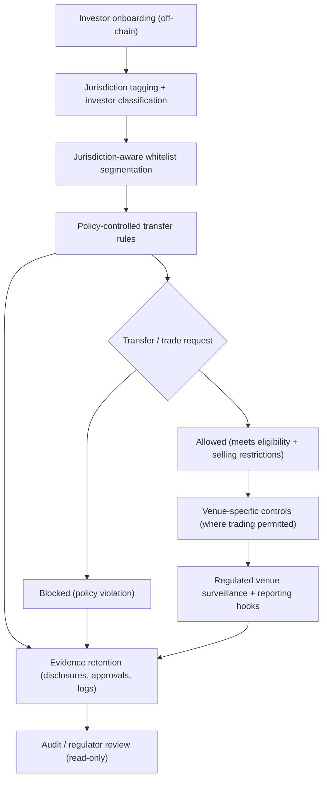

```{=openxml}
<w:p><w:r><w:br w:type="page"/></w:r></w:p>
```

```{=latex}
\newpage
```

```{=html}
<div style="page-break-before: always;"></div>
```

# Debt Offering Flow (Escrow + Closing Threshold)

This diagram illustrates a capital-light origination model where borrower drawdown depends on escrowed subscriptions meeting a documented close threshold. The token represents economic rights only; KYC/AML and eligibility are performed off-chain.

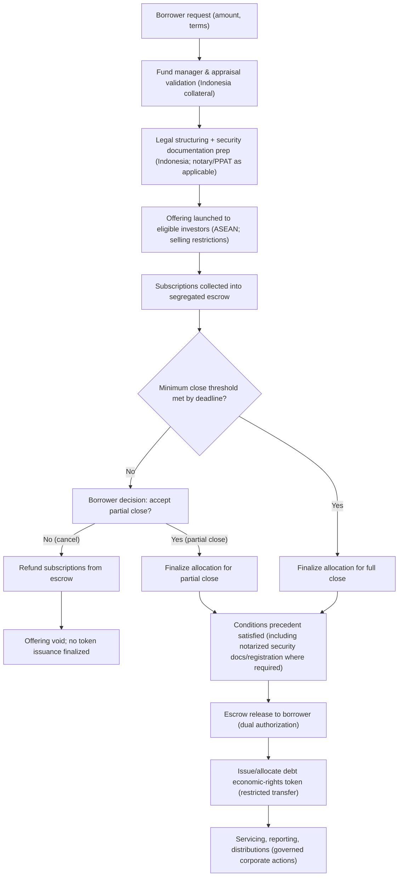

```{=openxml}
<w:p><w:r><w:br w:type="page"/></w:r></w:p>
```

```{=latex}
\newpage
```

```{=html}
<div style="page-break-before: always;"></div>
```

# Escrow Reconciliation Workflow (High-Level)

This diagram illustrates daily reconciliation and close-day controls for escrow-based offerings. It is designed to support auditability and investor protection (accurate allocations, timely refunds, and controlled releases).

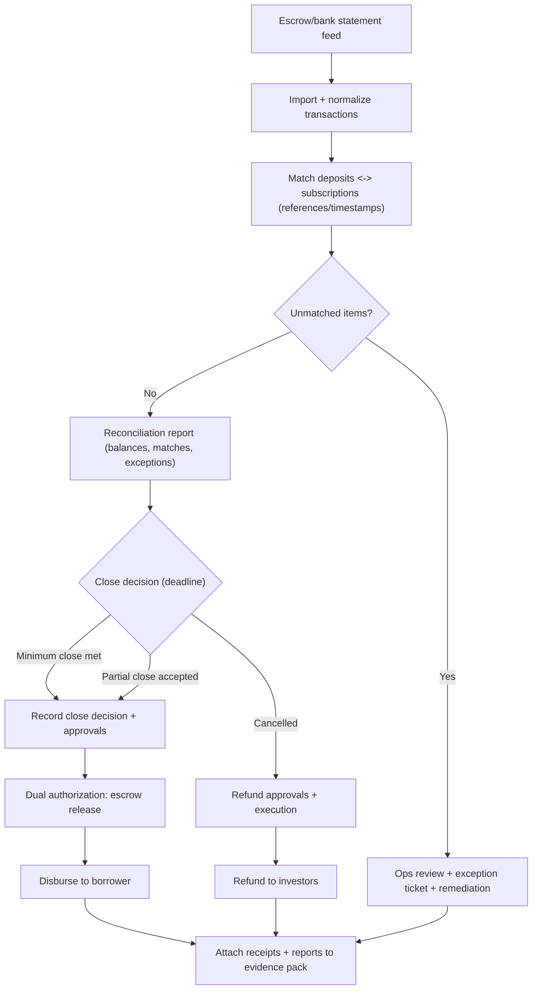

```{=openxml}
<w:p><w:r><w:br w:type="page"/></w:r></w:p>
```

```{=latex}
\newpage
```

```{=html}
<div style="page-break-before: always;"></div>
```

# Governance, Audit, and Monitoring Loop (High-Level)

This diagram shows how monitoring signals and audit evidence feed governance decisions and control improvements in a hybrid compliance architecture.

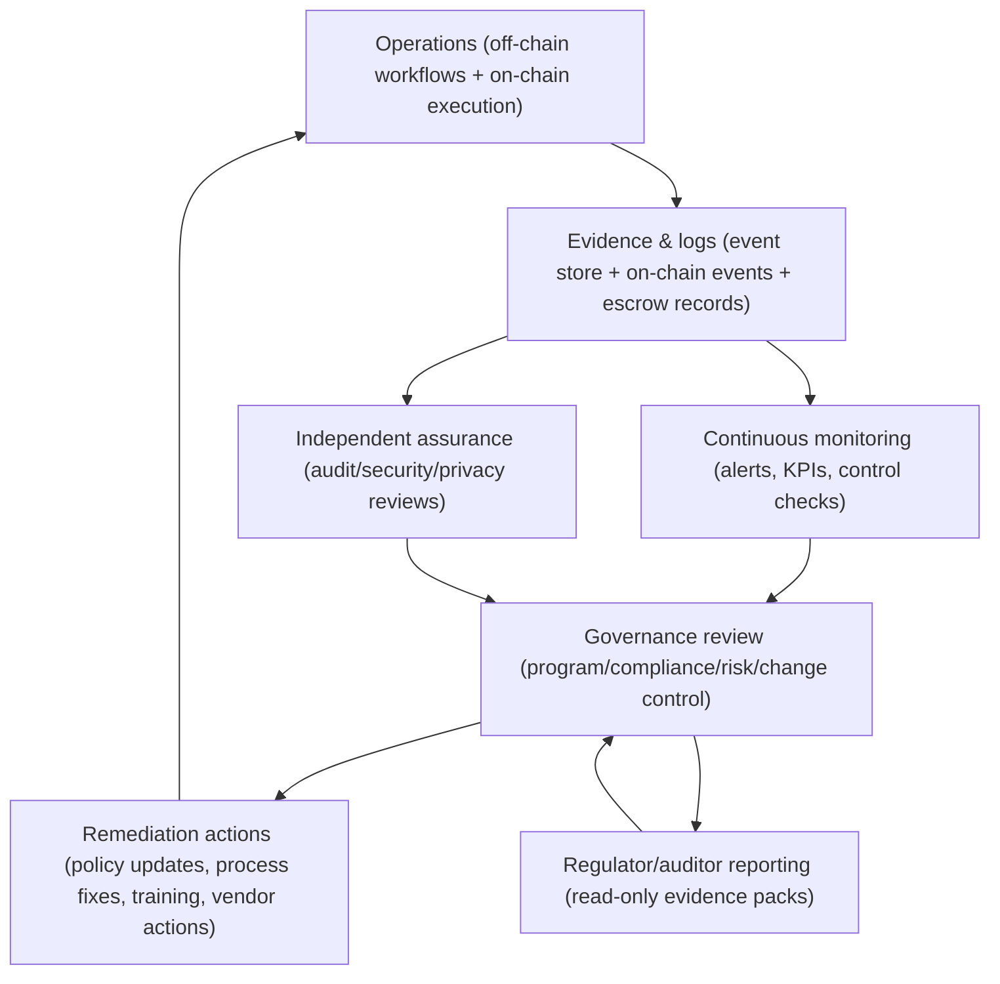

```{=openxml}
<w:p><w:r><w:br w:type="page"/></w:r></w:p>
```

```{=latex}
\newpage
```

```{=html}
<div style="page-break-before: always;"></div>
```

# Hybrid Compliance Architecture (High-Level)

This diagram shows the hybrid on-chain/off-chain compliance architecture used in this program. Personal data and regulated compliance operations remain off-chain; on-chain components focus on controlled execution and tamper-evident event logs.

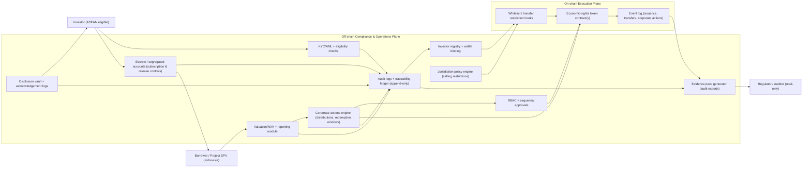

```{=openxml}
<w:p><w:r><w:br w:type="page"/></w:r></w:p>
```

```{=latex}
\newpage
```

```{=html}
<div style="page-break-before: always;"></div>
```

# Issuance Lifecycle (High-Level)

This diagram summarizes the issuance lifecycle for an escrow-based offering with close thresholds and restricted token issuance.

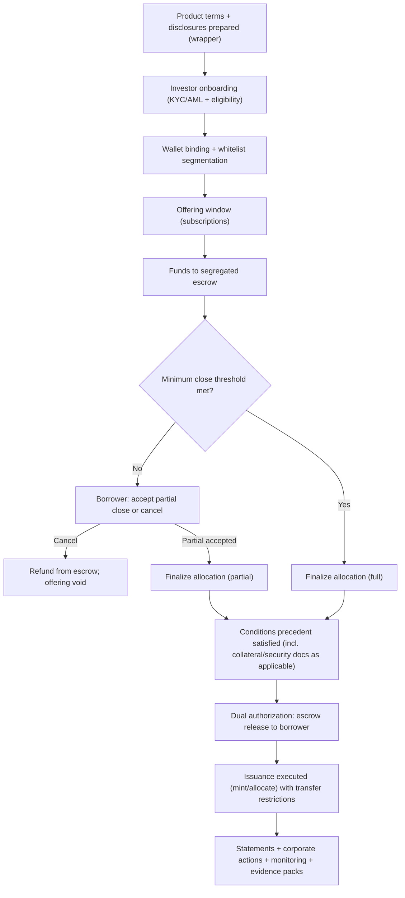

```{=openxml}
<w:p><w:r><w:br w:type="page"/></w:r></w:p>
```

```{=latex}
\newpage
```

```{=html}
<div style="page-break-before: always;"></div>
```

# Liquidity Engineering Map (Not Automatic Liquidity)

This diagram shows the engineered liquidity pathways: primary-market closing mechanics (including escrow + close threshold for debt), regulated venue strategy, optional market making, NAV reference governance, and documented redemption mechanisms (if offered).

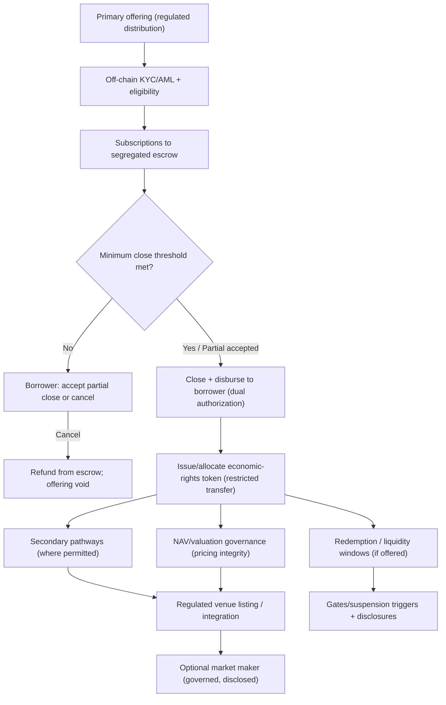

```{=openxml}
<w:p><w:r><w:br w:type="page"/></w:r></w:p>
```

```{=latex}
\newpage
```

```{=html}
<div style="page-break-before: always;"></div>
```

# Privacy Data Boundary (UU PDP / PDPA)

This diagram summarizes the privacy boundary: personal data stays off-chain under controlled access; on-chain stores only minimal operational events and cryptographic references for integrity.

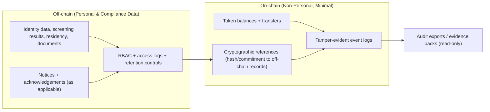

```{=openxml}
<w:p><w:r><w:br w:type="page"/></w:r></w:p>
```

```{=latex}
\newpage
```

```{=html}
<div style="page-break-before: always;"></div>
```

# Secondary Market and Exit Pathways (High-Level)

This diagram summarizes how investors may exit within a regulated, hybrid compliance framework. Secondary trading is venue-specific and not an assurance of liquidity; term-driven outcomes (e.g., maturity repayment) remain primary for many debt-like exposures.

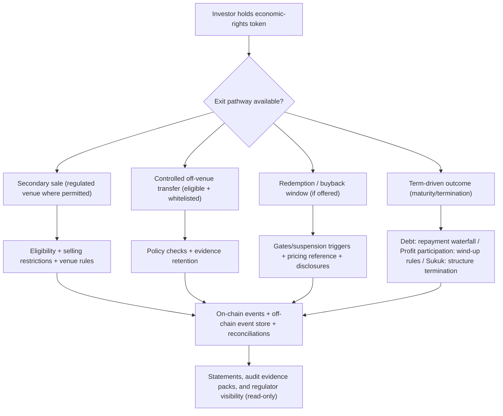

```{=openxml}
<w:p><w:r><w:br w:type="page"/></w:r></w:p>
```

```{=latex}
\newpage
```

```{=html}
<div style="page-break-before: always;"></div>
```

# Stakeholder and Operating Model (High-Level)

This diagram summarizes key stakeholders and interactions in the program. It reflects a single-SPV pilot that can later scale to multi-vehicle issuance under one standardized orchestration/control plane. The platform is positioned as an operator/orchestrator, not a regulator.

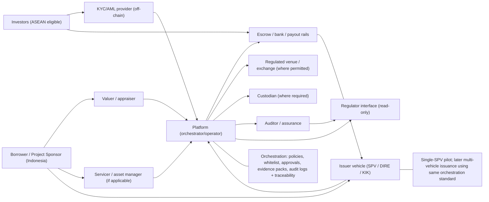

```{=openxml}
<w:p><w:r><w:br w:type="page"/></w:r></w:p>
```

```{=latex}
\newpage
```

```{=html}
<div style="page-break-before: always;"></div>
```

# Venues and Fiat Ramps (High-Level Overview)

This diagram summarizes how regulated venues and fiat on/off ramps relate to the economic-rights token lifecycle. It highlights that NFTs or crypto exchange rails do not change the regulatory perimeter of the economic rights represented.

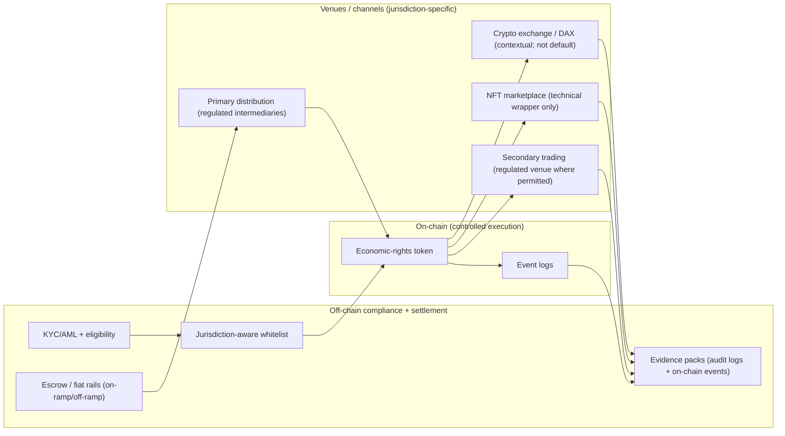

```{=openxml}
<w:p><w:r><w:br w:type="page"/></w:r></w:p>
```

```{=latex}
\newpage
```

```{=html}
<div style="page-break-before: always;"></div>
```

# Whitelist, KYC, and Identity Flow (Off-Chain Control Plane)

This diagram shows the compliance flow for onboarding, wallet binding, whitelist segmentation, and transfer decisioning. KYC/AML and personal data handling remain off-chain; on-chain stores only non-personal eligibility signals and event logs.

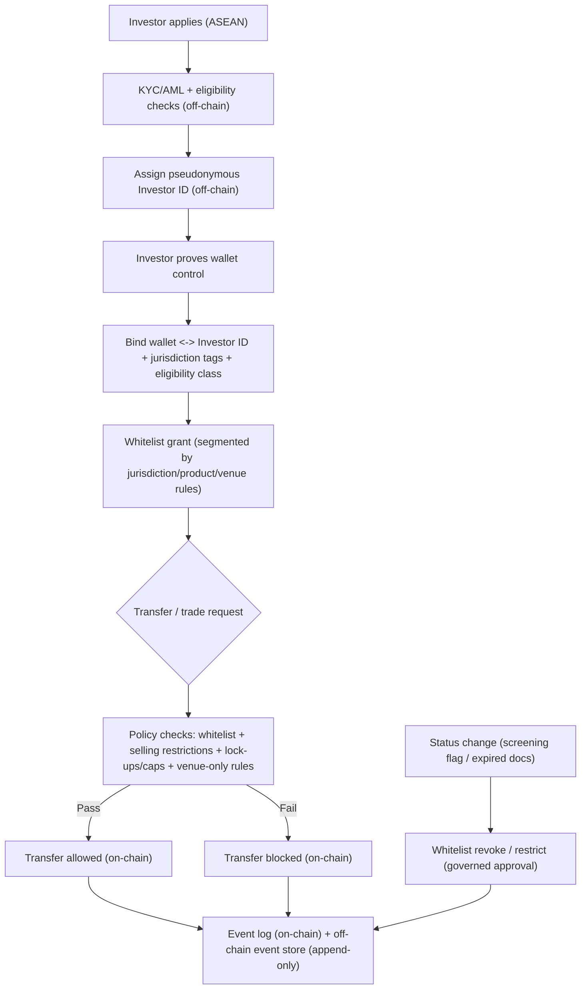
