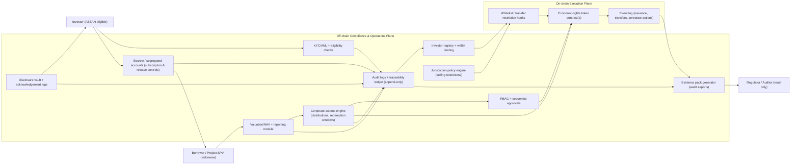
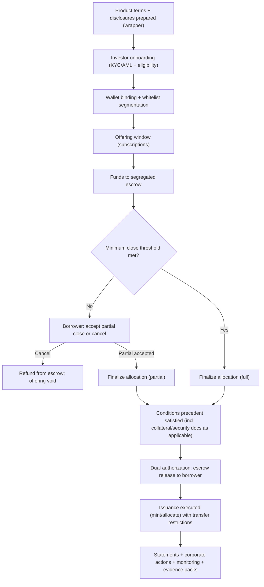
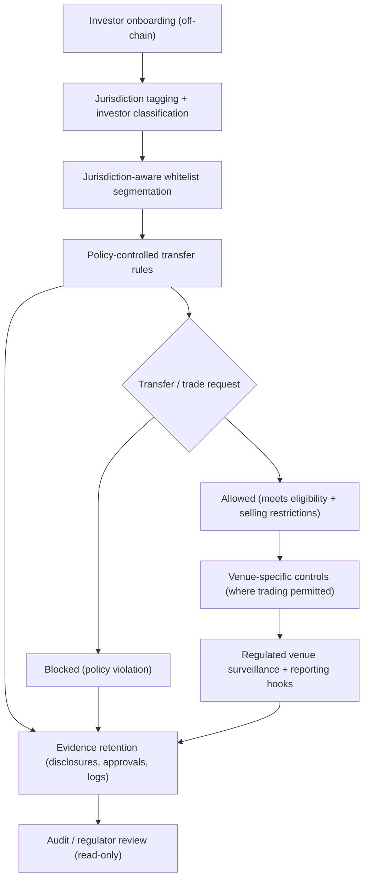

**Disclaimer:** This document is a working draft intended for discussion. It is not legal, financial, or regulatory advice. Tokenized instruments described herein represent economic rights only and do not transfer Indonesian land title.

```{=openxml}
<w:p>
  <w:r><w:rPr><w:sz w:val="18"/></w:rPr><w:t>Daftar Isi</w:t></w:r>
</w:p>
<w:p>
  <w:r><w:fldSimple w:instr="TOC \o &quot;1-3&quot; \h \z \u"/></w:r>
</w:p>
```

```{=latex}
\tableofcontents
```

```{=html}
<div id="TOC"></div>
```

```{=openxml}
<w:p><w:r><w:br w:type="page"/></w:r></w:p>
```

```{=latex}
\newpage
```

```{=html}
<div style="page-break-before: always;"></div>
```

# Executive Summary

## Purpose and Minimum Scope (ASEAN)

This whitepaper presents a compliance-oriented framework for real estate tokenization designed for deployment across ASEAN, with the underlying real estate assets domiciled in Indonesia. The objective is to enable regulated issuance, distribution, lifecycle administration, and secondary trading of tokens that represent **economic rights only**, while maintaining Indonesian property and land-title legal realities off-chain.

This framework positions Indonesia as a compliant issuance hub for ASEAN-regulated real estate exposure.

The minimum intended operating footprint is ASEAN. Cross-border participation is addressed through jurisdiction-aware controls and disclosures aligned to:

- Indonesia: OJK framework and UU PDP for personal data protection
- Singapore: MAS regulatory perimeter and PDPA requirements
- Malaysia: SC framework and PDPA requirements

This document does not assume permissionless global distribution or unregulated secondary markets. It describes a structure that is designed to support regulatory engagement, licensing pathways, and staged deployment (including controlled sandboxes where available).

This framework is not designed to bypass securities regulation through tokenization. It is structured to operate within applicable licensing, disclosure, selling restrictions, investor eligibility, and market supervision requirements across ASEAN jurisdictions.

## Asset and Token Model (Indonesia Underlying, Economic Rights Only)

The underlying asset jurisdiction is Indonesia. The token is structured to represent **economic rights** associated with an Indonesian real estate exposure (e.g., revenue participation, debt claim, rental yield participation, or other contractual cash flow rights), rather than ownership of land title or direct legal interest in the land registry.

### Legal Wrapper vs. Token Representation

This framework distinguishes between (i) the **legal wrapper** that creates and governs investor entitlements and (ii) the **token** that represents those entitlements for controlled administration:

- **Legal wrapper (off-chain legal stack):** Indonesian structures and contractual documentation (e.g., SPV/DIRE/KIK and associated agreements) define cash flow rights, governance, disclosures, servicing, investor protections, and enforceability.
- **Token (on-chain/off-chain administration layer):** represents the economic rights described in the documentation and enables controlled issuance, transfer restrictions, corporate actions, and tamper-evident event logs.

Tokenization does not alter the underlying property jurisdiction or remove the need for licensing, disclosures, selling restrictions, and regulated distribution channels.

Key legal and structural commitments:

- No transfer of land title via blockchain.
- Asset governance and legal enforceability remain within Indonesian legal structures.
- Token holders receive contractual economic entitlements defined in the issuance documents and enforced through the off-chain legal stack.

This approach is intended to reduce legal ambiguity by separating (i) Indonesian asset ownership and control from (ii) tokenized economic entitlements that may be distributed to eligible investors across ASEAN, subject to local securities law.

## Compliance-by-Design Architecture (Hybrid On-Chain / Off-Chain)

The proposed architecture is **hybrid by design**. It uses on-chain components for controlled token issuance and transfer, while retaining regulated compliance functions and sensitive data off-chain.

**Core principles**

- Off-chain KYC/AML and investor verification are mandatory.
- On-chain records store only the minimum necessary references (e.g., cryptographic commitments) to support auditability and integrity.
- Personal data is not stored on-chain; data minimization is the default.
- Role-based access control (RBAC) governs privileged actions (issuance, corporate actions, freezes, redemptions).
- Sequential / dual authorization supports separation of duties for critical actions.
- Regulator visibility can be supported through controlled reporting and audit interfaces.

**Operational implication**

The token is treated as part of a broader regulated workflow rather than an autonomous instrument. Transfers, redemptions, and corporate actions are executed subject to policy rules, whitelists, and event approvals that reflect jurisdictional constraints and investor eligibility requirements.

## Cross-Border Distribution Within ASEAN

ASEAN distribution introduces jurisdictional fragmentation across securities regulation, investor eligibility, marketing constraints, and data protection. This framework treats cross-border as a first-class requirement and proposes a jurisdiction-aware access model:

- A whitelist that is segmented by jurisdiction and investor classification (e.g., institutional / accredited where applicable).
- Policy-driven transfer rules that prevent routing to non-eligible wallets.
- Distributor and exchange integration that can apply local selling restrictions and disclosure packages.
- Governance and reporting that supports regulator inquiries without exposing personal data on-chain.

The intent is interoperability across ASEAN without assuming regulatory harmonization. The system is structured to support phased expansion country-by-country, with clear controls that can be audited and adjusted as regulatory guidance evolves.

## Supported Funding Models

The framework supports multiple regulated funding models to reflect investor demand and local market practice. The same compliance architecture can support different economic-rights configurations, provided issuance documentation clearly specifies entitlements, risk, and governance.

### Summary of models (illustrative)

| Funding model | Token represents | Primary use | Key regulatory alignment considerations | Liquidity expectation |
| --- | --- | --- | --- | --- |
| Debt | Debt claim and repayment waterfall | Fixed-income style financing | Securities / debt instrument perimeter, disclosure, servicing, default handling | Engineered via exchange pathways and redemption terms; not guaranteed |
| Profit participation (REIT-like) | Contractual participation in distributable cash flows (as permitted) | Income participation | Securities / collective investment perimeter (depending on wrapper), governance, information rights, related-party controls | Dependent on listing venue and market structure |
| Sukuk | Asset-backed participation (e.g., ijarah-based rental yield participation) | Shariah-compliant financing | Shariah structuring and supervisory oversight, asset-backing, prohibition of riba | Dependent on venue adoption and market making arrangements |
| Crowdfunding | Economic participation with caps and investor protections | Broader participation under regulated limits | Retail constraints (where applicable), caps, suitability, disclosures | Typically limited; must be engineered and may be periodic |

Each model requires explicit alignment to local regulatory categories and licensing. This whitepaper focuses on a reusable compliance and control plane, rather than prescribing a single legal wrapper for all ASEAN jurisdictions.

## Liquidity Engineering (Not Automatic Liquidity)

Liquidity must be engineered through market design, regulated venues, and investor protection mechanisms; tokenization alone is insufficient.

This framework emphasizes liquidity engineering through the following components:

- **Dual-market model:** primary issuance and lifecycle operations coordinated with secondary trading venues where permitted.
- **Regulated exchange integration:** listing and trading subject to venue rules, surveillance, and participant eligibility.
- **Market maker model:** optional arrangements to support orderly markets, subject to local rules and disclosures.
- **NAV reference / pricing integrity:** integration with reference data (including independent valuation inputs) to support transparent pricing and periodic reporting.
- **Redemption and liquidity windows:** defined mechanisms for redemption or buyback under documented terms, supporting investor exits without implying continuous liquidity.

Where 24/7 trading capability is feasible from a technical perspective, it remains subject to exchange adoption, market participant availability, and regulatory constraints. The design goal is to enable liquidity pathways that are measurable, governed, and auditable.

Liquidity fragmentation across ASEAN jurisdictions is expected and must be managed through venue-specific controls.

## Benefits, Limitations, and Risk Posture

**Expected benefits (subject to regulatory alignment and operational execution)**

- Improved transparency and auditability of issuance and transfers through tamper-evident records.
- More efficient administration of investor entitlements (distributions, redemptions, corporate actions) via controlled automation.
- Stronger cross-border controls through jurisdiction-aware whitelisting and policy enforcement.
- Privacy-preserving compliance through off-chain handling of personal data with on-chain integrity references.

**Key limitations (explicitly acknowledged)**

- Regulatory approvals, licensing, and jurisdiction-by-jurisdiction compliance remain prerequisites.
- Tokens represent economic rights only and do not change Indonesian land-title requirements.
- Secondary trading and liquidity depend on venue availability and market structure; liquidity is not guaranteed.
- Cross-border scale requires careful operational governance, distributor controls, and data protection coordination.

## Implementation Approach and Next Steps

This whitepaper proposes a staged approach designed to support regulator engagement and operational readiness:

1. **Indonesia foundation:** define the Indonesian asset-holding structure, servicing model, data controller responsibilities, and issuance documentation for economic rights.
2. **Compliance control plane:** implement the hybrid on-chain/off-chain workflows (off-chain KYC, jurisdiction-aware whitelist, RBAC, sequential approval, reporting).
3. **Venue and distribution integration:** integrate regulated exchanges and/or regulated distribution channels aligned with each ASEAN jurisdiction’s selling restrictions.
4. **Liquidity design and monitoring:** specify market making policies (if used), pricing integrity inputs, redemption terms, and ongoing market surveillance metrics.
5. **Sandbox and phased rollout:** pilot in controlled environments where applicable, expand coverage as regulatory feedback and operational performance justify scaling.

The remainder of this whitepaper details the problem statement, regulatory boundaries, architecture, cross-border design, privacy model, liquidity strategy, supported funding models (including Shariah-compliant structures), risks, mitigations, and an implementation roadmap for ASEAN deployment with Indonesian underlying assets.

```{=openxml}
<w:p><w:r><w:br w:type="page"/></w:r></w:p>
```

```{=latex}
\newpage
```

```{=html}
<div style="page-break-before: always;"></div>
```

# Problem Statement

## Context: Real Estate Exposure and ASEAN Capital Formation

Real estate is a core asset class across ASEAN, but cross-border capital formation and participation remain constrained by regulatory fragmentation, operational friction, and limited secondary-market pathways for private or semi-private exposures. For Indonesian assets in particular, investor access outside Indonesia is typically mediated through layered structures, manual onboarding, and limited transferability of economic interests.

This whitepaper addresses the gap between:

- Investor demand for regulated ASEAN real estate exposure; and
- The operational and compliance burden of issuing, administering, and transferring economic interests across jurisdictions.

## Problems to Solve

### 1) Fragmented Regulatory Perimeters Across ASEAN

ASEAN jurisdictions apply different rules to securities, collective investment schemes, distribution, investor eligibility, and marketing. For Indonesian underlying assets, cross-border participation requires a control framework that can enforce selling restrictions and provide auditable evidence of compliance without relying on regulatory arbitrage.

**Implication:** cross-border distribution must be jurisdiction-aware by design, not layered as an afterthought.

### 2) High-Friction Onboarding and Compliance Operations

Traditional issuance and servicing workflows rely on fragmented systems: KYC onboarding, subscription processing, register maintenance, corporate actions, distributions, redemptions, and reporting often require manual reconciliation across stakeholders. This increases:

- Operational risk (errors, delays, inconsistent registers)
- Cost-to-serve (especially for smaller ticket sizes)
- Difficulty in supporting multi-country participation

**Implication:** lifecycle administration should be standardized and automated where appropriate, while preserving regulatory controls and auditability.

### 3) Limited Liquidity Pathways and Weak Price Discovery

Tokenization is frequently assumed to imply liquidity; in practice, real estate exposures often face:

- Sparse trading and fragmented venues
- Restrictions on transferability due to selling constraints
- Valuation frequency mismatches (real estate vs. trading cadence)
- Lack of market making and orderly-market frameworks

**Implication:** liquidity must be engineered through venue strategy, market structure, and documented redemption mechanisms (if any), without implying continuous liquidity.

### 4) Data Protection and Cross-Border Personal Data Handling

Investor onboarding and ongoing compliance require processing personal data. ASEAN data protection regimes (including Indonesia’s UU PDP and PDPA regimes in other ASEAN markets) introduce constraints on:

- Data minimization and retention
- Cross-border data transfers
- Incident response and breach notification
- Accountability (data controller / processor responsibilities)

**Implication:** personal data should not be placed on public ledgers; compliance architecture must be privacy-preserving and auditable.

## Structural Solution (High-Level)

This whitepaper proposes a **hybrid on-chain/off-chain compliance architecture** for tokens representing **economic rights only** associated with Indonesian real estate exposures. The architecture aims to:

- Standardize lifecycle administration (issuance, transfers, distributions, redemptions)
- Enforce jurisdiction-aware selling restrictions and investor eligibility via whitelisting and policy controls
- Preserve privacy by storing personal data off-chain and anchoring integrity proofs on-chain
- Enable regulator-aligned reporting and audit interfaces

## Regulatory Alignment and Non-Arbitrage

The framework is designed to operate within securities regulation and related licensing obligations. Tokenization is treated as a method of representation and administration of economic rights, not as a mechanism to bypass regulatory requirements. The system prioritizes:

- Clear categorization and disclosure per funding model
- Controlled distribution channels and market supervision where secondary trading is permitted
- Documented governance and control points for privileged lifecycle actions

## Cross-Border Implications (ASEAN Minimum)

Cross-border participation is expected to remain heterogeneous across ASEAN. The framework therefore assumes:

- Country-by-country rollout and approvals
- Venue-specific controls to manage liquidity fragmentation across jurisdictions
- Modular compliance controls to support evolving guidance without redesigning the underlying economic-rights model

```{=openxml}
<w:p><w:r><w:br w:type="page"/></w:r></w:p>
```

```{=latex}
\newpage
```

```{=html}
<div style="page-break-before: always;"></div>
```

# Scope and Non-Scope

## Scope (In-Scope)

This whitepaper covers an ASEAN-minimum tokenization framework for Indonesian underlying real estate assets, where the token represents **economic rights only** and is administered through a **hybrid on-chain/off-chain compliance architecture**.

### Geographic Scope

- Minimum scope: ASEAN region.
- Initial regulatory focus (minimum set): Indonesia, Singapore, Malaysia.
- Expansion model: phased rollout by jurisdiction and venue.

### Asset and Rights Scope

- Underlying assets: Indonesian real estate exposures held through Indonesian legal structures.
- Tokenized representation: contractual economic entitlements (e.g., distributions, repayment waterfalls, redemption rights if offered).
- Explicit exclusion: land title transfer or claims on land registry via blockchain.

### Functional Scope

- Issuance lifecycle: onboarding, subscription, issuance, register maintenance.
- Transfer controls: whitelist enforcement, selling restrictions, eligibility checks.
- Corporate actions: distributions, redemptions/buybacks (if applicable), updates to rights terms under governed processes.
- Reporting: audit trails, compliance logs, investor statements, regulator-oriented reporting interfaces (where appropriate).

### Funding Models Supported

- Debt
- Profit participation (REIT-like economic rights; contractual participation in distributable cash flows)
- Sukuk (Shariah-aligned asset-backed participation)
- Crowdfunding (with caps and investor protections, where permitted)

### Liquidity Engineering Scope

- Venue strategy and integration (regulated exchanges / regulated channels)
- Market structure and surveillance considerations
- Optional market maker arrangements (subject to local rules)
- NAV reference data integration and pricing integrity approaches
- Redemption mechanisms and liquidity windows (documented; not implied to be continuous)

## Regulatory Design Constraints (ASEAN Minimum)

This framework is designed around regulatory and operational constraints that commonly apply in ASEAN markets. The intent is to explain why the chosen approach (economic-rights-only tokens, hybrid compliance architecture, jurisdiction-aware whitelisting, and venue-specific controls) is necessary.

The table below is a high-level constraint summary (non-exhaustive). Final requirements are jurisdiction- and venue-specific and depend on the chosen legal wrapper and licensing pathway.

| Constraint area | Indonesia (OJK + UU PDP) | Singapore (MAS + PDPA) | Malaysia (SC + PDPA) | Design implication in this whitepaper |
| --- | --- | --- | --- | --- |
| Instrument perimeter and classification | Economic-rights instruments may fall within securities/collective investment perimeters depending on structure and distribution | Classification and perimeter depend on product features and distribution channel | Classification and perimeter depend on product features and distribution channel | Avoid regulatory arbitrage; structure disclosures and controls per model (debt/profit participation/sukuk/crowdfunding) |
| Distribution and selling restrictions | Offering and distribution typically require regulated channels, eligibility controls, and documented disclosures | Marketing, distribution, and eligibility constraints apply; may require licensed intermediaries | Marketing, distribution, and eligibility constraints apply; may require licensed intermediaries | Off-chain onboarding + eligibility engine + evidence retention for disclosures |
| Secondary trading and market conduct | Secondary trading pathways are venue-dependent; market conduct and surveillance expectations apply where trading is permitted | Trading is venue-dependent; market conduct and surveillance expectations apply | Trading is venue-dependent; market conduct and surveillance expectations apply | Venue-specific controls; no permissionless markets; liquidity engineering rather than implied liquidity |
| KYC/AML and investor verification | KYC/AML and screening obligations require controlled workflows | KYC/AML and screening obligations require controlled workflows | KYC/AML and screening obligations require controlled workflows | KYC/AML remains off-chain; jurisdiction-aware whitelist required |
| Personal data protection and cross-border data handling | UU PDP requires privacy-by-design, minimization, and accountable handling | PDPA requirements for minimization, protection, and accountable processing | PDPA requirements for minimization, protection, and accountable processing | Personal data kept off-chain; on-chain stores minimal integrity references |
| Custody / safeguarding expectations | Safeguarding and governance expectations apply to client assets and operational controls | Safeguarding and governance expectations apply to client assets and operational controls | Safeguarding and governance expectations apply to client assets and operational controls | RBAC, sequential approvals, audit logs, and clear operational accountability |

## Non-Scope (Out-of-Scope)

To maintain regulatory clarity and prevent misinterpretation, the following items are explicitly out of scope:

- Transfer of Indonesian land title via blockchain or token custody.
- Permissionless DeFi distribution, unregulated AMMs, or anonymous trading.
- Assumptions of global (non-ASEAN) distribution as a default expansion path.
- Claims of automatic or guaranteed liquidity, returns, or regulatory approval.
- Replacement of regulated intermediaries where licensing or supervision is required.

## Boundaries and Dependencies

### Legal and Regulatory Dependencies

- Applicable licensing, approvals, and disclosure regimes remain prerequisites.
- Cross-border selling restrictions and investor classification rules must be implemented per jurisdiction.

### Operational Dependencies

- Off-chain KYC/AML, screening, and investor verification are mandatory.
- Custody, payment rails, and servicing arrangements must be defined and auditable.

### Technology Dependencies

- Secure key management and access controls for privileged actions.
- Integrity and audit logging across both on-chain and off-chain components.

```{=openxml}
<w:p><w:r><w:br w:type="page"/></w:r></w:p>
```

```{=latex}
\newpage
```

```{=html}
<div style="page-break-before: always;"></div>
```

# Stakeholders and Roles

## Overview

Real estate tokenization for ASEAN distribution requires coordinated roles across legal, compliance, operational, market infrastructure, and technology domains. This section identifies the stakeholders assumed in this framework and their responsibilities in a hybrid on-chain/off-chain model for Indonesian underlying assets.

Reference diagram: `02-figures/diagrams/stakeholder-operating-model.md`.

## Operating Model Summary (Illustrative)

The table below summarizes the operating roles typically required to run an ASEAN-distributed program with Indonesian underlying assets. Exact role allocation depends on the chosen legal wrapper, licensing pathway, and jurisdiction-specific requirements.

### Platform Positioning (Operator / Orchestrator, Not the Regulator)

For ASEAN or national scale, this whitepaper assumes the program should remain open to **multiple issuance vehicles** (e.g., multi-SPV or series/compartment structures) rather than a single “mega SPV”. This improves ring-fencing, disclosure clarity, and operational governance across different projects and funding models.

For the pilot stage, a **single Indonesian issuance vehicle (single SPV)** can be used to validate end-to-end controls (KYC/whitelist/escrow/corporate actions/auditability) in a constrained setting. If the pilot meets readiness gates, the same orchestration layer is reused to scale across additional issuance vehicles without weakening controls.

In this operating model, the platform is positioned primarily as:

- **a compliance and operations orchestrator:** runs the off-chain control plane (KYC/eligibility, whitelist governance, escrow workflows, evidence packs, reporting), and coordinates with regulated intermediaries and venues; and
- **a technology operator:** operates the hybrid system (policy enforcement, audit logging/traceability, and auditability).

The platform does not “set regulation” or override country rules. It implements **jurisdiction-specific policies** and selling restrictions derived from legal/compliance requirements and partner venue/channel rules, with auditable enforcement and evidence retention.

| Function | Typical accountable party | Key responsibilities (high-level) | Evidence / outputs (illustrative) |
| --- | --- | --- | --- |
| Issuer / originator | Issuer/originator | product definition, disclosures, governance, ongoing obligations | disclosure pack, notices, approvals, periodic reporting |
| Asset-holding and enforceability | Indonesian SPV / DIRE / KIK (as applicable) | hold/operate Indonesian property exposure; enforce contractual rights | legal docs, asset registers, servicing agreements |
| Fund management / asset management (if applicable) | Fund manager / asset manager | asset oversight, performance monitoring, cash flow governance | asset reports, valuation inputs, governance minutes |
| Valuation / appraisal | Independent valuer/appraiser | valuation inputs and methodology governance | valuation reports, NAV inputs, update logs |
| KYC/AML + eligibility | Regulated/approved KYC provider + compliance function | identity verification, screening, eligibility classification, monitoring | onboarding records, screening logs, eligibility decisions |
| Investor registry / transfer agent | Registry/transfer agent function | authoritative register; wallet binding; transfer restrictions evidence | registry snapshots, whitelist logs, reconciliation exports |
| Escrow and fiat settlement rails | Bank/custodian/escrow agent (as applicable) | segregated accounts, controlled releases/refunds, payout rails | escrow statements, release approvals, refund logs |
| Tokenization operator (technology) | Platform operator / technology provider | operate hybrid workflows, policy enforcement, audit logging | system logs, event store exports, control reports |
| Trading venue (where permitted) | Regulated venue / exchange | venue onboarding coordination, surveillance, trade rule enforcement | trade reports, surveillance outputs, venue rule evidence |
| Custody (where required) | Custodian | safeguarding, access controls, operational governance | custody policies, access logs, audit reports |
| Audit / assurance | Auditor / assurance provider | audit evidence packs, control assurance, financial audit | audit reports, assurance statements, findings logs |
| Regulator interface (read-only) | Program governance | structured reporting and evidence access | evidence packs, reconciliations, supervisory reports |

Data controller/processor responsibilities for personal data must be explicitly assigned in the operating model, including for cross-border processing and evidence retention.

## Legal Accountability Mapping (Illustrative)

The table below makes legal accountability explicit. Final role allocation and liability scope depend on the selected Indonesian wrapper, licensing pathway, contracts, and jurisdiction-specific requirements. This framework does not shift legal accountability to software; it makes accountability auditable.

| Role | Legal status (illustrative) | Liability scope (high-level) |
| --- | --- | --- |
| Issuer vehicle (SPV / DIRE / KIK) | Indonesian entity / Indonesian regulated wrapper (as applicable) | asset holding and enforceability; issuance terms; disclosures; investor entitlements as documented |
| Originator / sponsor | Indonesian company or project sponsor (as applicable) | asset sourcing, representations, ongoing obligations as contracted; conflicts disclosures |
| Manager / fund manager / asset manager (if applicable) | Licensed/authorized entity (jurisdiction- and wrapper-specific) | financial structuring (where applicable); governance; portfolio oversight; reporting cadence and valuation governance |
| Servicer (debt) / property manager (income) | Contracted service provider (may require licensing depending on function) | collections, servicing actions, covenant monitoring, default process execution per mandate; reporting to issuer/governance |
| Compliance operator (control plane) | Licensed/contracted entity (KYC provider + compliance function + operator roles) | KYC/AML enforcement; eligibility classification; whitelist governance; evidence retention for compliance decisions |
| Escrow agent / bank / payment rail provider | Regulated financial institution / contracted escrow agent | segregated accounts; release/refund controls; settlement records and statements |
| Custodian (where required) | Regulated custodian | safeguarding; access controls; custody reporting; incident response as contracted |
| Trading venue (where permitted) | Regulated venue / exchange | market conduct controls; surveillance; participant/venue rule enforcement; trade reporting where applicable |
| Valuer / appraiser | Independent professional firm (as applicable) | valuation inputs; methodology integrity; update cadence per mandate |
| Auditor / assurance | Independent auditor/assurance provider | assurance over financials and/or controls; findings and remediation tracking |
| Platform (technology operator/orchestrator) | Contracted technology operator (may be licensed depending on activities) | system operation; policy enforcement as configured; audit logging/traceability; incident management; does not replace regulated accountabilities |

## Core Stakeholders

### Regulators and Supervisory Authorities

Regulators set the perimeter for issuance, distribution, market conduct, and data protection. The framework is designed to support regulator visibility through auditable controls and structured reporting, without implying pre-approval.

Examples (ASEAN minimum scope):

- Indonesia: OJK; data protection regulator under UU PDP regime
- Singapore: MAS; PDPA enforcement authority
- Malaysia: SC; PDPA enforcement authority

### Issuer / Originator

The issuer/originator sources the Indonesian underlying asset exposure, defines token economic rights, and is accountable for disclosures and ongoing obligations to token holders.

Responsibilities:

- Asset selection, due diligence, and ongoing asset management oversight
- Disclosure package (risk, cash flow model, valuation approach, governance)
- Corporate actions, distributions, and servicing oversight

### Asset-Holding Structure (SPV / DIRE / KIK)

The Indonesian asset-holding structure is the legal anchor for ownership and enforceability. It remains the primary locus for asset governance and contractual obligations.

Responsibilities:

- Own/hold the Indonesian underlying asset exposure
- Define contractual entitlements backing the economic rights token
- Maintain legal documentation and enforceability mechanisms

### Investors (Institutional / Eligible Categories)

Investors participate subject to eligibility and selling restrictions per jurisdiction and channel. Investor rights are defined by the issuance terms and enforced through the legal structure and controlled token administration.

Responsibilities:

- Provide KYC/AML information via off-chain processes
- Comply with transfer and resale restrictions
- Receive disclosures, statements, and notices

## Market Infrastructure Stakeholders

### Distributors / Placement Agents

Regulated distributors execute primary placement and apply local selling restrictions, disclosures, and suitability requirements (where applicable).

### Exchanges / Trading Venues (Regulated)

Exchanges and other regulated trading venues provide secondary trading where permitted, including market surveillance, participant onboarding (or coordination with issuer onboarding), and trading rule enforcement.

### Market Makers / Liquidity Providers (Optional)

Market makers may support orderly markets under venue rules and documented agreements. Their participation does not guarantee liquidity; it is an engineered component subject to constraints and disclosures.

### Custodians and Wallet Infrastructure Providers

Custodians provide safekeeping and access controls where required. Wallet infrastructure must support whitelist enforcement and policy-based transfers.

## Service Providers

- KYC/AML providers (off-chain): identity verification, screening, ongoing monitoring
- Valuers / appraisal providers: valuation inputs and periodic updates
- Auditors: controls, financial reporting, and (where relevant) smart contract assurance
- Legal counsel: structure, disclosures, cross-border selling restrictions
- Shariah supervisory board/advisors (for sukuk and Shariah-aligned offerings)

## Governance and Accountability Model

The framework assumes clear accountability for:

- Data controller / processor roles (privacy compliance)
- Privileged action approvals (RBAC and sequential approvals)
- Incident response and dispute resolution
- Change management for token terms and system policies (under controlled governance)

```{=openxml}
<w:p><w:r><w:br w:type="page"/></w:r></w:p>
```

```{=latex}
\newpage
```

```{=html}
<div style="page-break-before: always;"></div>
```

# Architecture (Hybrid On-Chain / Off-Chain Compliance)

## Architecture Objectives

The architecture is designed to support regulated issuance and lifecycle administration of tokens representing **economic rights only** for Indonesian underlying real estate exposures, with ASEAN-minimum cross-border participation. The system is explicitly **compliance-enabling**.

Reference diagram: `02-figures/diagrams/hybrid-compliance-architecture.md`.

This whitepaper assumes scale is achieved through **multiple issuance vehicles** (e.g., multi-SPV or series/compartment structures) under Indonesian jurisdiction, with the platform operating a common compliance control plane rather than concentrating all exposures into a single vehicle. For the pilot stage, a single-SPV deployment can be used to validate the orchestration and evidence model before expanding to multiple vehicles.

## Why a Hybrid Blockchain Architecture?

This framework uses blockchain selectively to strengthen traceability and control outcomes within a regulated operating model.

### Tamper-Evident Audit Trail

On-chain event logs provide an immutable, tamper-evident record of key lifecycle events (issuance, transfers, corporate actions signaling, and enforcement actions where applicable). This reduces ambiguity during audits and dispute resolution by providing a consistent reference that can be reconciled against off-chain records.

### Enforceable Transfer Restrictions

Transfer restrictions are enforced through a combination of off-chain eligibility decisions and on-chain execution controls. The result is that resale and transfer rules (whitelists, lock-ups, venue-only rules where used) can be enforced consistently, with traceable outcomes (allowed/blocked) and governed exception handling.

### Cross-Border Consistency (ASEAN Minimum)

ASEAN participation requires jurisdiction-aware rules and controlled channels. A hybrid architecture supports consistent enforcement patterns across jurisdictions and venues while allowing jurisdiction-specific policy sets to be activated gradually during phased rollout.

### Evidence Portability

Because issuers, distributors, venues, auditors, and regulators may need to review evidence, the model emphasizes portable evidence packs. On-chain references and event logs support evidence portability by providing stable, verifiable anchors that can be shared without disclosing personal data on-chain.

### High-Level Architecture (Visual)



Primary objectives:

- Enforce jurisdiction-aware eligibility and selling restrictions
- Maintain an accurate, auditable investor register and transfer history
- Enable controlled automation for corporate actions (distributions, redemptions)
- Preserve privacy by keeping personal data off-chain
- Support regulator-oriented reporting and supervision interfaces

## Design Constraints (Non-Negotiables)

- **Hybrid model mandatory:** critical compliance functions remain off-chain.
- **KYC/AML always off-chain:** identity verification and screening are not performed on-chain.
- **Personal data not stored on-chain:** on-chain stores only minimal references for integrity/audit.
- **Jurisdiction-aware whitelist required:** cross-border transfers are policy-controlled.
- **No permissionless DeFi:** distribution and secondary trading are through regulated pathways.

## System Components

### Off-Chain Components (Compliance and Operations)

- **Operational audit logging and traceability ledger (append-only):** the off-chain operational layer maintains an append-only audit trail capturing onboarding, eligibility decisions, disclosures, approvals, allocations, escrow status changes, corporate actions, and reconciliations. This supports deterministic evidence packs, investigations, and audits.
- **Investor onboarding and KYC/AML service:** identity verification, screening, ongoing monitoring.
- **Eligibility engine:** jurisdiction-aware rules (investor type, residency, selling restrictions).
- **Investor registry / transfer agent module:** authoritative register mapping investors to permitted wallet addresses.
- **Document and disclosure vault:** offering docs, investor notices, certificates, versioned disclosures.
- **Corporate actions engine:** schedules and executes distributions, redemptions, notices, and approvals.
- **Fiat settlement and ramp integration (escrow plane):** segregated escrow accounts, controlled releases (dual authorization), refunds, and payout rails; supports local currency constraints (e.g., Rupiah settlement for Indonesian flows) and cross-border collection via regulated intermediaries.
  - Pilot default: Indonesian escrow and domestic settlement rails (Indonesia-first distribution and evidence validation).
  - Cross-border extension: add jurisdiction-specific collection/payout partners and, where required, local escrow arrangements without weakening approvals, evidence retention, or reconciliation discipline.
- **Valuation and reporting module:** NAV inputs, periodic statements, audit exports.
- **Audit and regulator reporting interface:** read-only reports, event logs, and evidence packages.

Off-chain policies enforced by these components are derived from documented legal/compliance requirements (including jurisdiction- and venue-specific rules). They are versioned, approved, and auditable; they are not discretionary “platform rules”.

### On-Chain Components (Controlled Execution and Auditability)

- **Token contract(s):** represent economic rights; implement transfer restrictions and lifecycle events.
- **Policy hooks:** whitelist checks, jurisdiction tags, and configurable transfer controls.
- **Corporate action functions:** controlled distribution/redemption triggers (subject to RBAC and approvals).
- **Event log:** tamper-evident record of key lifecycle events and policy outcomes.

## Roles, Controls, and Authorization Model

The architecture uses RBAC and sequential approvals for privileged actions. Illustrative roles:

- **Issuer admin:** proposes issuance and corporate actions (no unilateral execution).
- **Compliance officer:** approves eligibility rules, whitelists, and restricted actions.
- **Operations / transfer agent:** executes reconciliations, registry maintenance, and statements.
- **Custodian / wallet admin (where applicable):** manages custody policies and access.
- **Auditor / regulator viewer:** read-only visibility into logs and evidence packages.

### Sequential Approval Pattern (Illustrative)

Critical actions (e.g., mint/issue, corporate action execution, emergency freeze) follow a controlled sequence:

1. Proposal created (off-chain workflow with evidence attachments)
2. Compliance review and approval (off-chain, logged)
3. On-chain execution enabled (time-bound, scope-bound)
4. Execution performed (on-chain transaction)
5. Post-event reconciliation and reporting (off-chain + on-chain event references)

## Token Lifecycle and Control Points

### 1) Onboarding and Wallet Binding (Off-Chain)

- Investor completes KYC/AML and eligibility assessment off-chain.
- Approved investors are assigned one or more permitted wallet addresses.
- The whitelist is updated through a governed workflow with audit logs.

Reference diagram: `02-figures/diagrams/issuance-lifecycle.md`.



## Whitelist, KYC, and Identity Controls (Off-Chain)

This framework uses off-chain identity and eligibility verification to support jurisdiction-aware transfer controls without storing personal data on-chain. The whitelist is treated as a compliance control mechanism, not a convenience feature.

Reference diagram: `02-figures/diagrams/whitelist-kyc-identity-flow.md`.

### Identity and KYC/AML (Off-Chain)

Identity verification and KYC/AML are performed off-chain, including (as applicable):

- identity proofing and document validation
- beneficial ownership and control checks for entities
- sanctions/PEP screening and risk-based due diligence
- ongoing monitoring and periodic refresh

Off-chain systems assign an internal, pseudonymous investor identifier for recordkeeping. Personal data remains off-chain under UU PDP/PDPA-aligned access controls and retention policies.

### Wallet Binding (Proof of Control)

Because on-chain transfers are executed by wallets, the operating model binds verified investors to one or more permitted wallet addresses:

- investor completes KYC/AML and eligibility assessment
- investor proves control of a wallet address (method defined by the operator and documented)
- the wallet is bound to the investor’s off-chain identity record and eligibility/jurisdiction tags
- wallet additions/removals are governed as controlled changes with audit trails

### Jurisdiction-Aware Whitelist Segmentation

Whitelist entries are segmented by:

- jurisdiction tags (investor jurisdiction, distribution jurisdiction, venue jurisdiction as applicable)
- investor eligibility category (e.g., institutional/eligible categories; capped retail where permitted)
- product constraints (debt/profit participation/sukuk/crowdfunding) and any lock-ups or resale limits

### Transfer Decisioning and Exceptions

Transfers (including venue-mediated trades where permitted) are allowed only if policy checks pass, typically requiring:

- sender and receiver wallets are whitelisted; and
- the transfer does not violate selling restrictions, lock-ups, caps, or venue-only rules.

If an investor status changes (e.g., screening flags, expired documents), whitelist privileges can be revoked or restricted through governed enforcement actions (e.g., hold/freeze), with auditable rationale.

### Auditability (Event-Sourced Evidence)

Whitelist and identity decisions are logged as append-only events in the off-chain event store (e.g., onboarding approved, eligibility class set, wallet bound, whitelist granted/revoked, transfer blocked with reason). This supports deterministic reconstruction of registers and evidence packs for audits and regulator inquiries.

### 2) Issuance and Subscription

- Subscriptions are accepted through regulated channels and documented.
- Issuance (minting) occurs only after approvals and receipt confirmation processes.
- On-chain issuance events reference off-chain documentation identifiers (integrity references only).

### 3) Transfers and Secondary Trading (Controlled)

Transfers are permitted only when:

- both sender and receiver wallet addresses are whitelisted; and
- the transfer complies with jurisdiction-specific selling restrictions and investor classification rules.

Where secondary trading is permitted, venue integration applies additional controls (venue onboarding, surveillance, trading rules).

### 4) Corporate Actions (Distributions and Redemptions)

Corporate actions are executed through controlled workflows:

- distribution schedules and entitlements are calculated off-chain
- execution is triggered on-chain only after approvals
- results are reconciled and evidenced through statements and audit exports

### 5) Exceptions and Enforcement

The system supports enforcement actions under governed conditions:

- freeze/hold actions (e.g., sanctions, dispute, court/regulator instructions)
- clawback or reversal logic only if legally supported and disclosed (otherwise avoided)
- incident response workflows with evidence preservation

## Data Model and Privacy Boundary

The architecture separates:

- **Personal and compliance data (off-chain):** identity data, screening outcomes, residency, documentation
- **Integrity and operational signals (on-chain):** eligibility/whitelist status indicators, event logs, cryptographic references

This separation supports ASEAN data protection requirements by preventing personal data leakage on-chain while retaining auditability.

### Logging and Traceability (Off-Chain)

To support regulator-grade auditability in a hybrid system, the off-chain layer maintains an **append-only audit trail** and traceability model:

- decisions and approvals are time-stamped and attributable (RBAC + sequential approvals)
- changes to policies, whitelists, and key operational states are versioned and traceable
- evidence packs can be generated reproducibly from logs, documents, and on-chain event references
- access to logs is governed via RBAC and data minimization; personal data remains off-chain and subject to retention policies

This approach is intended to reduce reconciliation ambiguity between on-chain events and off-chain operations and to improve traceability for audits and regulator inquiries. Detailed database architecture choices (including event sourcing) can be treated as part of the technical implementation.

## Regulator Visibility (Principle)

Regulator visibility is supported through:

- standardized evidence packages for issuances and corporate actions
- event log exports and reconciliation reports
- controlled access to audit trails (read-only) without exposing personal data on-chain

This is designed to facilitate supervision and reduce ambiguity during regulator engagement.

## Governance, Audit, and Monitoring (Program-Level)

This program assumes that “compliance-by-design” must be supported by formal governance, continuous monitoring, and independent audit/assurance. The governance model is designed to be compatible with a single-SPV pilot and reusable for multi-vehicle scaling under one orchestration/control plane.

Reference diagram: `02-figures/diagrams/governance-audit-monitoring-loop.md`.

### Governance Structure (Illustrative)

Typical governance bodies and responsibilities:

- **Program governance (steering):** approves product scope, jurisdiction rollout sequencing, and control baseline; reviews key incidents and remediation plans.
- **Compliance committee:** approves policy rules (selling restrictions, eligibility, whitelist governance), exception handling, and jurisdiction-specific control changes.
- **Risk committee:** reviews credit/market/operational risk posture, concentration limits, liquidity disclosures, and stress indicators (as applicable).
- **Change control board:** approves system changes that affect controls (smart contract changes, policy engine updates, data model changes), including rollback and evidence impacts.

Accountability is treated explicitly. See the legal accountability mapping in `01-draft/04-stakeholders.md`.

### Policy and Control Versioning

Because cross-border rules and venue requirements can evolve, policies are treated as controlled artifacts:

- policy sets are versioned by jurisdiction, venue/channel, and product model
- changes require approvals (RBAC + sequential approvals) and are time-stamped
- each issuance and transfer decision can be traced to the applicable policy version

This supports auditability and reduces ambiguity during dispute resolution or regulator inquiries.

### Auditability and Evidence Packs

Auditability is implemented through a combination of:

- on-chain tamper-evident event logs (issuance, transfers, corporate actions, enforcement actions)
- off-chain append-only audit logs and traceability for compliance and operations decisions
- reconciliations that tie the off-chain register to on-chain states and venue reports (where available)

Evidence packs (illustrative contents):

- onboarding and eligibility approvals (off-chain)
- disclosure delivery/acknowledgement logs (off-chain)
- whitelist change logs and policy versions (off-chain)
- escrow statements and release approvals (off-chain)
- on-chain transaction receipts and event exports (on-chain)
- reconciliation reports and exception handling records (hybrid)

### Continuous Monitoring (Control Monitoring)

Monitoring focuses on detecting control drift and operational issues, including:

- whitelist and policy change anomalies (unusual volumes, out-of-hours changes)
- blocked transfer spikes and exception rates (potential misconfiguration or misuse)
- escrow release and refund SLA breaches
- reconciliation breaks between on-chain balances and off-chain registers
- key management and privileged action alerts (RBAC violations, approval bypass attempts)

Monitoring outputs feed governance review and are retained as audit artifacts.

### Independent Assurance (Illustrative)

Independent assurance can include:

- operational controls audit (RBAC, approvals, evidence retention, reconciliations)
- privacy/security assessments (data boundary, access controls, incident response readiness)
- smart contract security review (before production use; after material changes)

Assurance scope and cadence depend on product scale, investor category, and jurisdiction/venue expectations.

```{=openxml}
<w:p><w:r><w:br w:type="page"/></w:r></w:p>
```

```{=latex}
\newpage
```

```{=html}
<div style="page-break-before: always;"></div>
```

# Cross-Border Design (ASEAN Minimum)

## Objective

The objective of the cross-border design is to enable **ASEAN-regulated participation** in Indonesian underlying real estate exposures while respecting jurisdiction-specific selling restrictions, investor eligibility rules, and data protection regimes. The framework does not assume regulatory harmonization across ASEAN and is not designed for regulatory arbitrage.

Reference diagram: `02-figures/diagrams/cross-border-jurisdiction-controls.md`.

This whitepaper assumes an **Indonesia-first pilot** (domestic distribution and settlement) followed by phased rollout to additional ASEAN jurisdictions. Cross-border controls are therefore specified as reusable design requirements that can be activated jurisdiction-by-jurisdiction once legal pathways and operating partners are in place.

## Cross-Border Control Flow (Visual)



## Jurisdictional Constraints Informing the Approach

Cross-border design in ASEAN is shaped by three recurring realities:

- **Classification variability:** the same economic rights may be treated differently depending on wrapper, distribution, and local categories.
- **Channel dependency:** both primary distribution and secondary trading are typically constrained to regulated channels/venues (where permitted).
- **Privacy and accountability:** personal data handling (including cross-border transfers) must be governed under UU PDP/PDPA obligations.

As a result, the architecture prioritizes jurisdiction-aware controls and auditable evidence over assumptions of uniform cross-border portability.

## Cross-Border Operating Model

### Jurisdiction-Aware Participation

Cross-border participation is implemented through:

- **jurisdiction tagging** (investor jurisdiction, distribution jurisdiction, venue jurisdiction)
- **eligibility classification** (institutional/accredited/other permitted categories)
- **policy-controlled transfers** (whitelists and rule checks)

This ensures the system can enforce conditions such as:

- who can participate
- where marketing and distribution can occur
- how resale/transfer restrictions are applied

### Distribution Channels

Primary distribution is expected to occur via regulated channels (e.g., licensed distributors/placement agents) with:

- appropriate disclosures and risk statements
- investor suitability/appropriateness checks where required
- evidence retention for audits and regulator inquiries

### Secondary Trading Pathways

Secondary trading, where permitted, is mediated through regulated venues and venue-specific rules. The architecture supports:

- venue onboarding integration (or coordination with issuer onboarding)
- trading restrictions tied to the whitelist and jurisdiction policies
- surveillance and reporting hooks (subject to venue capability)

Liquidity fragmentation across ASEAN jurisdictions is expected and must be managed through venue-specific controls and rollout sequencing.

### Secondary Trading vs. Exit Assurance (Clarification)

Secondary trading is only one potential exit pathway and should not be interpreted as an assurance of exit. Exit planning must be disclosed per product model and jurisdiction, and may rely on term-driven outcomes (e.g., maturity repayment for debt-like instruments) and/or governed redemption windows (if offered).

## Market Infrastructure: Venues, Exchanges, NFTs, and Fiat Ramps

This framework distinguishes market infrastructure by **regulatory function**, because the same technology (tokens) may fall under different rules depending on the rights represented and the distribution/trading channel.

### 1) Regulated Securities / Capital Markets Venues (Primary Target for Economic-Rights Tokens)

Economic-rights tokens that represent investment entitlements (debt-like repayment claims, profit participation, sukuk participation, or regulated crowdfunding interests) are generally expected to sit within securities / capital markets perimeters depending on the wrapper and jurisdiction. As a result, the preferred trading and distribution pathways are regulated capital markets venues or regulated distribution channels that can:

- enforce investor eligibility and selling restrictions
- support market conduct controls and surveillance (where trading occurs)
- provide auditable reporting and evidence retention

This whitepaper therefore treats “exchange integration” as **venue-specific** and aligned with regulated market infrastructure, not as permissionless crypto trading.

### 2) Crypto Exchanges / Digital Asset Exchanges (Contextual, Not Default)

Crypto exchanges and digital asset exchanges are commonly regulated with a focus on AML/CFT and trading of crypto assets. They can be relevant to this program only if:

- the venue is permitted to list/handle the relevant category of token under local rules; and
- the venue can support jurisdiction-aware eligibility and transfer restrictions; and
- listing and disclosure requirements are compatible with the product’s regulatory perimeter.

Where those conditions cannot be met, crypto exchanges are not treated as appropriate venues for economic-rights tokens.

### 3) NFT Marketplaces / NFT Exchanges (Only as a Technical Wrapper, Not a Regulatory Shortcut)

NFTs can be used as a technical representation for unique positions (e.g., a specific debt note series or tranche) but they do not change the regulatory nature of the rights represented. If an NFT conveys investment/economic entitlements, it should be governed by the same controls as other economic-rights tokens:

- off-chain identity and KYC/AML
- jurisdiction-aware whitelist and policy enforcement
- venue- and channel-specific selling restrictions

This framework does not tokenize land title, and does not rely on NFT marketplaces as a compliance bypass.

### 4) Fiat On/Off Ramps (Escrow, Settlement, and Local Currency Constraints)

Fiat on/off ramps are treated as part of the off-chain compliance and settlement plane:

- investor subscriptions are collected into segregated escrow accounts
- disbursements occur only after documented conditions precedent and dual authorization
- distributions/redemptions (if offered) return funds via controlled payout rails

**Indonesia currency constraint:** domestic payment and settlement flows in Indonesia are designed around Rupiah usage requirements and central-bank payment system rules. This reinforces the hybrid approach: settlement for Indonesian flows is handled through regulated fiat rails and escrow, while on-chain components focus on controlled token administration and auditability.

**ASEAN implication (phased rollout):** when extending beyond an Indonesia-first pilot, cross-border subscriptions may require local collection and FX processes via regulated intermediaries, with evidence retention and jurisdiction-aware eligibility controls.

### Escrow Strategy for Phased Rollout (High-Level)

To reduce operational complexity in the pilot while keeping the model extensible:

- **Pilot default:** a single Indonesian escrow/segregated account structure is used as the closing gate for Indonesian underlying assets.
- **Cross-border extension (later):** add jurisdiction-specific collection and payout partners (local rails) and, only where required, local escrow arrangements—while maintaining the same evidence and approval standards across all flows.

## Regulatory Design Constraints (ASEAN Minimum, High-Level)

The following high-level constraints are included to justify the design choices in this section. They are non-exhaustive and do not replace jurisdiction-specific legal analysis.

Related mapping table: `02-figures/tables/regulatory-constraint-control-mapping.md`.

| Constraint area | Cross-border impact | Design response |
| --- | --- | --- |
| Selling restrictions and investor eligibility | Eligibility may differ by jurisdiction; resale may be constrained | Jurisdiction-aware whitelist segmentation and policy-driven transfer controls |
| Distribution channel requirements | Cross-border distribution often requires regulated intermediaries and evidence retention | Distributor integration patterns and disclosure acknowledgement tracking |
| Venue access and market conduct | Trading access differs by venue; surveillance expectations apply where trading is permitted | Venue-specific controls, phased rollout, and auditable transfer enforcement |
| Data protection and cross-border transfers | More parties and jurisdictions increase privacy risk surface | Off-chain personal data boundary; controlled access; accountable controller/processor roles |
| Operational accountability across parties | Multi-party operations introduce control gaps if responsibilities are unclear | RBAC, sequential approvals, and standardized evidence packages |

## Compliance Control Mechanisms

### Jurisdiction-Aware Whitelist

The whitelist is segmented by jurisdiction and investor eligibility category. Transfers require that:

- the receiving wallet is approved for the relevant jurisdictional rule-set; and
- the transfer does not violate selling restrictions or lock-up requirements.

### Selling Restriction Enforcement (Illustrative)

Controls may include:

- lock-up periods after issuance
- transfer limits by investor category
- restrictions on marketing and solicitation by jurisdiction
- venue-only trading for specific jurisdictions

### Evidence and Auditability

Cross-border distribution requires evidence packages that can be produced on demand:

- onboarding/eligibility outcomes (off-chain)
- disclosures delivered and acknowledged (off-chain)
- issuance and transfer event logs (on-chain)
- reconciliation of on-chain events with off-chain registers (off-chain)

## Regulatory Alignment (ASEAN Minimum)

The architecture is structured to support engagement within:

- Indonesia (OJK perimeter; UU PDP)
- Singapore (MAS perimeter; PDPA)
- Malaysia (SC perimeter; PDPA)

The whitepaper does not claim that a single structure is universally accepted across all ASEAN jurisdictions. Instead, it proposes:

- a consistent control plane (hybrid compliance architecture)
- modular jurisdiction-specific rule sets
- staged rollout with legal validation and regulator engagement per market

## Cross-Border Data Protection Considerations

Cross-border operations can involve data transfers (e.g., to distributors, venues, service providers). The framework therefore assumes:

- data minimization and purpose limitation
- controlled cross-border transfer mechanisms consistent with applicable laws
- clear data controller/processor roles and breach/incident procedures

Personal data remains off-chain and is managed through controlled access; on-chain records store only minimal integrity references.

## Limitations and Residual Risks

- Cross-border participation may remain limited to institutional or eligible categories depending on local rules.
- Secondary trading may be restricted or unavailable in some jurisdictions; access can differ by venue.
- Operational governance across multiple parties is complex and requires clear accountability and contracts.

These limitations are treated as design inputs and are addressed through venue selection, phased rollout, and robust compliance operations.

```{=openxml}
<w:p><w:r><w:br w:type="page"/></w:r></w:p>
```

```{=latex}
\newpage
```

```{=html}
<div style="page-break-before: always;"></div>
```

# Privacy and Personal Data (Indonesia UU PDP and ASEAN PDPA)

## Objective

This section describes a privacy model aligned with Indonesia’s UU PDP and ASEAN PDPA regimes (minimum scope: Singapore and Malaysia). The objective is to support regulated issuance and cross-border participation without placing personal data on-chain.

Reference diagram: `02-figures/diagrams/privacy-data-boundary.md`.

Key principles:

- Data minimization and purpose limitation
- Personal data stored off-chain under controlled access
- On-chain stores only cryptographic references and operational events
- Clear accountability for data controller/processor responsibilities

## Data Boundary: Off-Chain Personal Data, On-Chain Integrity

### Off-Chain Data (Personal and Compliance Data)

Off-chain systems store:

- identity and verification artifacts
- KYC/AML screening outcomes and ongoing monitoring flags
- investor eligibility classification and residency indicators
- signed acknowledgements of disclosures and notices (where applicable)

Access is controlled through RBAC, logging, and contractual governance with service providers.

### On-Chain Data (Non-Personal, Minimal)

On-chain records store:

- token balances and transfer events
- whitelist status indicators (not identity details)
- cryptographic references to off-chain records to support integrity and auditability

This separation reduces privacy leakage risk while maintaining verifiable operational logs.

## Accountability: Data Controller and Processor Responsibilities

The framework assumes that accountability is explicitly defined in the operating model, including:

- which entity acts as the data controller for investor onboarding data (often linked to the asset-holding/issuer structure)
- which entities act as processors (KYC providers, distributors, venues, technology operators)
- contractual controls for sub-processing, retention, and breach obligations

## Consent, Notices, and Data Subject Rights (Operational View)

The onboarding process should provide:

- clear notices on what data is collected and why
- retention periods and lawful basis for processing (as applicable)
- practical workflows to address data subject requests (access, correction, deletion where permitted)

Because on-chain data is immutable, the design avoids storing personal data on-chain to prevent conflict with deletion/correction obligations.

## Cross-Border Data Transfers (ASEAN Minimum)

Cross-border distribution may require transferring personal data between:

- issuer/originator and KYC providers
- distributors/placement agents
- exchanges/venues (for onboarding coordination)

The framework therefore assumes:

- data minimization for any cross-border transfer
- purpose limitation and access logging
- structured governance for cross-border transfer compliance under UU PDP and relevant PDPA regimes

## Security Controls (Illustrative)

- encryption at rest and in transit for off-chain data
- strong authentication and least-privilege RBAC
- key management policies and separation of duties
- immutable audit logs and periodic access reviews
- incident response playbooks and evidence preservation

## Retention, Access Governance, and Redaction

Privacy compliance and auditability require explicit governance over how long records are kept, who can access them, and how data is minimized when shared across parties and jurisdictions.

Minimum requirements (high-level):

- **Retention schedules:** define retention periods for KYC artifacts, screening results, disclosures, audit logs, and evidence packs, aligned to applicable obligations and purpose limitation.
- **Access governance:** enforce RBAC, least privilege, and periodic access reviews for personal data and compliance evidence.
- **Redaction and minimization:** when providing evidence to auditors, venues, or cross-border partners, share only what is required (redacted where appropriate) and retain a record of what was shared.
- **Cross-border evidence sharing:** treat evidence sharing as a governed process with accountability (controller/processor roles), logging, and secure transfer mechanisms.

## Regulator and Audit Support (Privacy-Preserving)

Regulator and auditor support is implemented through:

- evidence packages that can be generated without exposing personal data on-chain
- controlled read-only access to audit logs and reconciliations
- redaction and minimization practices for reports shared across jurisdictions

## Cross-Border Implications

Cross-border participation increases privacy risk surface area due to more parties and data flows. The framework mitigates this through:

- a strict off-chain personal data boundary
- jurisdiction-aware access policies
- venue-specific controls and data handling agreements

Residual risk remains and must be managed through governance, audits, and ongoing compliance monitoring.

```{=openxml}
<w:p><w:r><w:br w:type="page"/></w:r></w:p>
```

```{=latex}
\newpage
```

```{=html}
<div style="page-break-before: always;"></div>
```

# Liquidity Engineering

Reference diagram: `02-figures/diagrams/liquidity-engineering-map.md`.
Related diagram: `02-figures/diagrams/secondary-market-and-exit-pathways.md`.

## Two Liquidity Problems (Distinguish Clearly)

In this program, “liquidity” refers to two distinct requirements that should not be conflated:

- **Origination / drawdown liquidity:** whether borrower funding can be delivered on schedule.
- **Investor exit liquidity:** whether token holders can sell or redeem their position after issuance.

This whitepaper treats investor exit liquidity as market- and venue-dependent, while origination liquidity can be engineered through primary-market design and operating controls.

## Principle: Tokenization Is Not Automatic Liquidity

Tokenization can improve transferability and operational efficiency, but it does not automatically create liquidity. Real estate exposures remain subject to:

- investor eligibility constraints
- selling restrictions and venue requirements
- valuation cadence and disclosure obligations
- market participant appetite and risk pricing

Liquidity must therefore be engineered through market design, regulated infrastructure, and documented mechanisms that protect investors and support orderly markets.

## Liquidity Objectives

- Provide credible exit pathways aligned with regulatory constraints
- Support price discovery with valuation integrity and disclosure discipline
- Reduce operational friction in transfers and settlement (where permitted)
- Maintain market conduct controls (surveillance, restricted trading where required)

## Market Structure: Dual-Market Model

### Primary Market (Issuance)

The primary market is executed through regulated distribution channels, with:

- off-chain KYC/AML and eligibility checks
- documented subscriptions and allocations
- controlled on-chain issuance (after approvals)

#### Escrow + Close Threshold (Capital-Light Origination Liquidity)

For debt-based offerings, origination liquidity can be engineered without relying on a platform balance sheet by using **segregated escrow accounts and defined closing thresholds**:

- investor commitments are collected into escrow during the offering window;
- closing proceeds only if the raise meets a documented **minimum close** (and other conditions precedent, including Indonesian collateral/security documentation steps such as notary/PPAT processes where applicable);
- if the threshold is not met, the borrower may accept a partial close (if permitted) or cancel; if cancelled, escrow funds are refunded and the offering is void.

This approach reduces the need for an open-ended backstop and makes funding certainty an explicit contractual outcome, supported by auditable escrow release controls.

### Secondary Market (Trading)

Secondary trading is enabled only where permitted, through regulated venues or controlled transfer mechanisms. The architecture supports:

- venue integration for onboarding coordination and trading rule enforcement
- whitelist enforcement and jurisdiction-aware restrictions
- auditable event logs and post-trade reconciliation to the investor registry

Liquidity fragmentation across ASEAN jurisdictions is expected and must be managed through venue-specific controls and rollout sequencing.

## Secondary Market Design (Regulated, Venue-Specific)

### Objectives

Secondary trading is designed to provide controlled transferability and price discovery where permitted, while protecting investors and maintaining evidence for audits. It is explicitly not designed as permissionless crypto trading.

### Venue Strategy (Where Trading Is Permitted)

Secondary trading should occur via regulated venues or regulated channels that can support:

- participant onboarding coordination (or reliance on issuer onboarding)
- market conduct controls and surveillance expectations
- enforcement of selling restrictions and eligibility (jurisdiction-aware)
- auditable reporting and evidence retention

Venue access may differ by jurisdiction, investor category, and product model. The program therefore expects fragmentation and treats “listing” as a phased, venue-by-venue decision.

### Transferability Rules (Beyond Wallet Whitelisting)

Secondary-market transferability typically requires additional constraints beyond wallet whitelisting, such as:

- lock-up periods after issuance
- resale constraints by investor category (e.g., institutional-only)
- venue-only trading requirements for specific jurisdictions
- caps or throttles (where retail constraints apply, such as crowdfunding contexts)

These constraints are implemented through policy versioning and auditable transfer decisioning (allowed/blocked with reason).

### Settlement and Register Integrity

Because the authoritative register is off-chain in a hybrid model, secondary trading requires reconciliation discipline:

- on-chain events provide tamper-evident transfer logs
- off-chain event store records policy outcomes and evidence references
- post-trade reconciliation ties venue reports (where available) to on-chain and off-chain states

The design goal is to prevent “shadow registers” and to ensure that statements, corporate actions, and entitlements are computed from a consistent, auditable record.

### Secondary-Market Limitations (Explicit)

- Secondary trading may be unavailable in some jurisdictions or investor categories.
- Trading may be restricted to specific regulated venues and onboarding requirements.
- Liquidity is not guaranteed; engineered pathways can be paused or constrained under venue rules or stress conditions.

## Liquidity Tools (Engineered, Not Implied)

### 1) Regulated Exchange / Venue Integration

Where feasible, listing on a regulated venue can support:

- market surveillance and orderly-market rules
- standardized participant onboarding and disclosures
- transparent trade reporting

Trading capability (including 24/7 from a technical standpoint) remains subject to venue adoption, participant availability, and local constraints.

### 2) Market Maker Model (Optional)

Market makers can support tighter spreads and continuous quotes, subject to:

- venue rules and supervision
- documented agreements and conflict-of-interest management
- disclosure of the market making model and its limitations

Market making does not guarantee liquidity and may be reduced or withdrawn under stressed conditions.

### 3) Pricing Integrity and NAV Reference

Pricing integrity is supported through:

- independent valuation inputs and periodic updates
- clear NAV methodology and reporting cadence
- governance over data sources and updates

NAV reference data can support:

- investor reporting and transparency
- redemption pricing (if offered)
- limits and controls during abnormal market conditions

### 4) Redemption Mechanisms and Liquidity Windows

If the structure offers redemption or buyback, it should be documented with:

- eligibility and timing (e.g., periodic windows)
- pricing references and haircut policies (if applicable)
- limits (gates) and suspension triggers under stress
- funding sources for redemptions and associated risks

Redemption mechanisms provide structured exit pathways but require careful governance to avoid adverse selection and liquidity mismatch.

## Exit Pathways (Investor Exits and Program Wind-Down)

Exit planning is a core investor protection requirement. This framework distinguishes between (i) investor exits during the life of the exposure and (ii) end-of-life outcomes driven by the product terms.

### Investor Exit Pathways (During Life)

Where permitted and documented, investors may exit through:

- **secondary sale on a regulated venue:** subject to eligibility and selling restrictions
- **controlled off-venue transfers:** only between eligible, whitelisted wallets with evidence retention
- **redemption windows / buyback programs (if offered):** governed terms, gates, and disclosures

The offering documents must state clearly which exit pathways are available for each product model and jurisdiction, and what limitations apply.

### End-of-Life Outcomes (Term-Driven)

End-of-life outcomes depend on the model:

- **Debt-like instruments:** repayment at maturity and/or scheduled amortization under the repayment waterfall; default handling is governed by servicing and enforcement procedures.
- **Profit participation (REIT-like):** continued participation until a defined termination event, asset sale, or fund/vehicle wind-up under the wrapper rules.
- **Sukuk structures:** termination and cash flow outcomes per structure documentation and supervisory governance.
- **Crowdfunding:** outcomes per documented terms, caps, and investor protections (often more constrained for secondary exits).

### Orderly Wind-Down (Program-Level)

The program should define a wind-down approach that preserves investor rights and auditability, including:

- continuity of the investor registry and statements (including transfer agent responsibilities)
- continuity of servicing and corporate actions (distributions, notices) or orderly cessation per terms
- custody and key management handover procedures (where applicable)
- preservation of evidence packs and audit logs for required retention periods

Wind-down planning is especially important for multi-vehicle scaling, where issuer vehicles may terminate at different times.

## Monitoring and Control Metrics (Illustrative)

Liquidity engineering requires ongoing monitoring, such as:

- order book depth and spread metrics (per venue)
- turnover ratio and concentration indicators
- price vs. NAV deviations and volatility thresholds
- redemption request volumes and gating usage (if applicable)
- cross-venue fragmentation indicators

## Regulatory Alignment

Liquidity mechanisms must be aligned to:

- market conduct and surveillance expectations (where trading occurs)
- disclosure standards (risk, pricing integrity, conflicts of interest)
- investor protection rules (eligibility, marketing constraints)

The framework is designed to support regulator engagement by providing transparent controls, auditable processes, and documented limitations (including explicit non-guarantee of liquidity).

## Cross-Border Implications (ASEAN Minimum)

Cross-border liquidity is structurally constrained by:

- different investor eligibility rules by jurisdiction
- venue access differences across ASEAN markets
- data protection and reporting requirements

As a result, liquidity is expected to be **fragmented** rather than unified. The framework manages this through jurisdiction-aware whitelists, venue-specific controls, and staged expansion rather than assuming a single ASEAN-wide pooled market from day one.

```{=openxml}
<w:p><w:r><w:br w:type="page"/></w:r></w:p>
```

```{=latex}
\newpage
```

```{=html}
<div style="page-break-before: always;"></div>
```

# Funding Models (Debt, Profit Participation, Sukuk, Crowdfunding)

## Purpose

This section describes how different funding models can be supported using the same hybrid compliance architecture, while maintaining the core legal boundary:

- underlying assets remain under Indonesian jurisdiction
- token represents economic rights only
- distribution and transfer are controlled through regulated channels

Each model must be documented and categorized with appropriate disclosures and governance. The framework is not intended to blur regulatory categories; it is intended to support regulated implementation.

## Indonesia Legal Wrapper Options (High-Level, Illustrative)

This whitepaper separates **legal wrappers** (which define rights, governance, disclosures, and enforceability) from **token representation** (which supports controlled administration and auditability). For Indonesian underlying assets, wrapper selection should be made with Indonesian counsel and regulator engagement as needed.

The table below is illustrative and intentionally high-level. The same economic rights can be represented in different wrappers depending on product design and permitted distribution channels.

| Funding model | Typical Indonesian wrapper patterns (illustrative) | Economic rights emphasis | Key operational implications |
| --- | --- | --- | --- |
| Debt | Project/loan SPV with contractual debt documentation; note/participation documentation tied to servicing | repayment waterfall and credit monitoring | servicing discipline, covenants, default process, escrow close controls |
| Profit participation (REIT-like) | Collective investment style wrapper (e.g., DIRE/KIK-like patterns) or structured participation agreements (as applicable) | distributable cash flows (e.g., rental income) and reporting | valuation/NAV governance, disclosures cadence, conflicts and related-party controls |
| Sukuk | Sukuk documentation set (e.g., ijarah-based) with Shariah governance artifacts | asset-backed participation return (rental yield / participation return) | Shariah oversight, use-of-proceeds governance, structure-specific evidence retention |
| Crowdfunding | Regulated crowdfunding wrapper patterns (platform/channel dependent) with caps and investor protections | capped participation rights (debt-like or profit-participation-like) | strict cap enforcement, suitability/disclosure controls, restricted transferability |

Wrapper selection does not remove the need for:

- off-chain KYC/AML and eligibility verification
- jurisdiction-aware selling restrictions and whitelist enforcement
- escrow and settlement controls (including close thresholds for debt offerings)
- auditability, evidence packs, and governance approvals

## Comparative Overview (Illustrative)

| Model | Economic rights represented | Typical cash flow basis | Key governance needs | Investor protection and compliance focus |
| --- | --- | --- | --- | --- |
| Debt | repayment claim and waterfall | scheduled payments and servicing | servicing oversight, covenants, default process | disclosure, credit risk, transfer restrictions |
| Profit participation (REIT-like) | contractual participation in distributable cash flows | net operating income and asset performance | governance, reporting, valuation oversight, related-party controls | disclosures, valuation integrity, conflicts, eligibility |
| Sukuk | asset-backed participation (e.g., ijarah) | rental yield / participation return | Shariah oversight, asset-backing governance | structure disclosure, Shariah compliance evidence |
| Crowdfunding | capped participation rights | distributions per terms; may be periodic | platform controls, caps, suitability | retail limits (where permitted), transparency, reporting |

## Token Economics (Fees, Cash Flows, and Cost Allocation)

In this program, “token economics” refers to **cash flow mechanics and fees** tied to the economic-rights instrument (debt-like repayments, profit participation distributions, sukuk participation returns, or crowdfunding entitlements). It does not refer to speculative token price mechanics.

### Fee Stack (Illustrative, Wrapper-Dependent)

Fees must be defined in the legal wrapper documents and disclosed clearly. Typical fee categories include:

- **origination/arrangement fees** (often debt/project-finance contexts)
- **management/administration fees** (registry/transfer agent, reporting, governance operations)
- **servicing fees** (loan servicing, collections, covenant monitoring)
- **custody and safeguarding fees** (where custody is required)
- **valuation and audit fees** (independent valuation inputs, assurance)
- **venue and trading fees** (where secondary trading occurs; venue fee schedules apply)
- **escrow and payment rail fees** (collection, disbursement, refunds)
- **FX and cross-border processing fees** (in later ASEAN rollout phases)

Fee disclosures should include the payer (borrower vs investor vs issuer), timing, calculation basis, and any caps.

### Cash Flow Waterfall (High-Level)

For each product model, the wrapper should define a waterfall (priority of payments), including:

- gross cash inflows (rental collections, repayments, participation returns)
- reserves (if any) and reserve release rules
- fees and expenses (with priority order)
- net amounts available for investor entitlements

### On-Chain vs Off-Chain Costs (Gas and Operations)

Because compliance and settlement are hybrid:

- **on-chain costs** (transaction fees) should be assigned explicitly: issuer-subsidized vs investor-paid vs venue-paid, with an operational policy for retail usability.
- **off-chain operational costs** (KYC, escrow, reporting, audits) should be reflected in the fee stack and evidenced through invoices/contracts and governance approvals.

This program avoids “hidden token fees”. Any transfer fees, protocol fees, or operator fees must be documented and disclosed.

### Conflicts of Interest and Related-Party Arrangements

If the platform or affiliates act in multiple roles (originator, servicer, valuation provider, market maker, distributor), the wrapper must disclose:

- the role combinations and potential conflicts
- governance controls and approval requirements
- how fees are set and reviewed

## 1) Debt Model (Fixed-Income Style)

### Problem Addressed

Debt financing for real estate requires efficient servicing, clear investor registers, and transparent credit monitoring—especially when distributed cross-border.

### Structural Solution

The token represents a debt claim and repayment waterfall defined in the issuance documents. The system supports:

- controlled issuance after subscription settlement
- investor register maintenance and transfer restrictions
- periodic payment calculations and distribution execution through governed workflows
- event logging for payment dates, notices, and covenant-related actions

### Origination Liquidity Without Platform Balance Sheet (Escrow + Close Threshold)

To reduce dependence on platform capital while preserving borrower certainty, the debt model can be structured as a **best-efforts raise with escrow and defined closing thresholds**:

1. Borrower requests financing terms and amount (e.g., up to 100% of the target size).
2. Fund manager/appraisal and legal due diligence validate the collateral and proposed terms (Indonesia), including preparation for collateral perfection and security documentation (notary/PPAT as applicable).
3. The offering is distributed to eligible investors through regulated channels; investor funds are collected into a **segregated escrow account**.
4. At a defined deadline, the raise outcome is assessed against documented thresholds:
   - if the raise meets the **minimum close** (and any other conditions precedent, including collateral perfection steps where required), closing proceeds;
   - if the raise does not meet the threshold, the borrower may be asked to **accept a partial close** (if permitted) or to cancel.
5. If cancelled, escrow funds are returned to investors according to documented procedures; no token issuance is finalized.
6. If closed, escrow releases funds to the borrower under dual authorization, and the debt economic-rights token is issued/allocated according to the final allocation.

This approach engineers **origination liquidity** through disciplined closing mechanics rather than through an open-ended platform backstop. It should be disclosed explicitly as best-efforts, with clear cancellation and refund rules.

### Regulatory Alignment

- categorize the instrument appropriately (debt/security perimeter)
- provide credit-risk and default disclosures
- ensure servicing and reporting obligations are met

### Cross-Border Implications

Debt tokens distributed across ASEAN require jurisdiction-aware selling restrictions and venue controls; secondary trading may be limited to eligible categories depending on the jurisdiction and venue.

## 2) Profit Participation Model (REIT-like Economic Rights)

### Problem Addressed

Profit participation requires consistent reporting, valuation integrity, and governance—often difficult to administer across many investors and jurisdictions.

### Structural Solution

The token represents contractual participation in distributable cash flows (e.g., rental cash flows) and related economic entitlements (as permitted by the structure). This is an economic-rights instrument and does not represent land ownership or land title. The architecture supports:

- controlled distributions linked to financial reporting cycles
- disclosure delivery and acknowledgements
- corporate action governance and auditable approvals

### Regulatory Alignment

- securities perimeter alignment and disclosure discipline
- governance expectations and related-party transaction controls
- periodic reporting and valuation governance

### Cross-Border Implications

Profit-participation structures may face stricter distribution constraints in some ASEAN jurisdictions (including collective investment style considerations depending on the wrapper). Whitelists and distributor controls are required, and liquidity is expected to fragment by venue and jurisdiction.

## 3) Sukuk Model (Shariah-Aligned, Asset-Backed Participation)

### Problem Addressed

Shariah-aligned real estate financing requires asset-backing, governance, and ongoing Shariah compliance evidence, while maintaining regulated investor protections.

### Structural Solution

The token represents Shariah-aligned economic rights (e.g., ijarah-based rental yield participation) documented in the structure. The system supports:

- controlled issuance with Shariah documentation references (off-chain)
- distribution schedules linked to rental yield / participation return
- governance workflows supporting Shariah oversight evidence and reporting

### Regulatory Alignment

- appropriate categorization under securities and Islamic finance frameworks
- disclosure of structure, asset-backing, and governance
- operational controls to ensure proceeds and cash flows remain within disclosed parameters

### Cross-Border Implications

Shariah products may have differentiated investor demand across ASEAN and may require jurisdiction-specific disclosures and approvals. Venue selection and distributor capability are material.

## 4) Crowdfunding Model (Capped Participation)

### Problem Addressed

Crowdfunding can broaden participation but requires strict caps, investor protections, suitability controls, and transparent reporting.

### Structural Solution

The token represents capped economic participation rights under documented terms. The system supports:

- eligibility gating and per-investor caps enforced off-chain and reflected in issuance controls
- disclosure delivery and acknowledgement tracking
- restrictions on transfers and resale consistent with crowdfunding constraints

### Regulatory Alignment

- comply with crowdfunding-specific limits and platform obligations (where applicable)
- emphasize investor protection: risk disclosures, cap enforcement, reporting cadence

### Cross-Border Implications

Cross-border crowdfunding is likely to be more constrained than institutional offerings. The framework assumes conservative eligibility, distributor controls, and jurisdiction-specific rollout.

## Implementation Notes: Common Control Plane

Across all models, the following controls are treated as common requirements:

- off-chain KYC/AML and investor verification
- jurisdiction-aware whitelist and selling restriction enforcement
- RBAC and sequential approvals for privileged actions
- auditable evidence packages for issuances and corporate actions

Liquidity expectations must be explicitly stated per model. Tokenization supports engineered pathways, but it does not guarantee liquidity.

```{=openxml}
<w:p><w:r><w:br w:type="page"/></w:r></w:p>
```

```{=latex}
\newpage
```

```{=html}
<div style="page-break-before: always;"></div>
```

# Shariah Considerations (Sukuk and Shariah-Aligned Offerings)

## Purpose

This section outlines how Shariah-aligned funding (including sukuk structures) can be supported within the same compliance-by-design framework, without diluting regulatory controls or investor protections. The discussion is operational and structural; Shariah opinions must be provided by qualified Shariah supervisory oversight.

## Phasing: Shariah as a Later Stage (After Pilot Validation)

This whitepaper treats Shariah-aligned offerings as a **subsequent phase** following an Indonesia-first pilot that validates the core orchestration controls (KYC/whitelist/escrow/corporate actions/auditability). The rationale is to avoid introducing additional governance and documentation complexity before the baseline control plane is proven.

When introduced, Shariah-aligned products should reuse the same hybrid compliance architecture and evidence model, while adding Shariah-specific governance, documentation, and monitoring requirements.

## Principles (Structural and Writing Constraints)

- Avoid framing returns as interest; use rental yield, participation return, or profit rate as appropriate.
- Maintain asset-backing and documented cash flow linkages.
- Support Shariah supervisory oversight, reporting, and evidence retention.
- Preserve the legal boundary: token represents economic rights only; Indonesian underlying asset jurisdiction remains unchanged.

## Structural Overview: Sukuk in an Indonesian Underlying Asset Context

In a sukuk configuration, the token represents Shariah-aligned participation rights backed by an underlying asset or its usufruct (usage/lease), with cash flows derived from documented contractual arrangements. The hybrid architecture supports:

- off-chain documentation and approvals (including Shariah documentation)
- controlled issuance and transfer restrictions (whitelist and eligibility controls)
- auditable corporate actions for distributions and notices

## Illustrative Sukuk Types (Not Exhaustive)

### Sukuk Ijarah (Lease-Based)

**Problem addressed:** provide Shariah-aligned exposure to stable rental yield derived from Indonesian real estate usage.

**Structural approach (illustrative):**

- cash flows derived from lease/rental arrangements
- distribution schedule and entitlement calculation governed and auditable
- disclosures emphasize asset-backing, risks (vacancy, lease renewal, counterparty), and governance

**Regulatory alignment:** ensure appropriate categorization and disclosures under applicable rules; coordinate with Shariah governance expectations.

**Cross-border implication:** Shariah investor demand may vary across ASEAN; jurisdiction-specific approvals and disclosures are expected.

### Other Sukuk Variants (High-Level)

Depending on the asset and project needs, variants may be considered (e.g., partnership- or trade-based structures). Each variant requires:

- clear documentation of underlying transactions
- evidence of asset-backing and permitted cash flow use
- supervisory oversight and periodic compliance confirmation

## Shariah Governance and Oversight

The framework assumes that Shariah-aligned offerings include:

- Shariah supervisory oversight (board/advisors)
- documented governance policies for permissible activities and cash flow handling
- periodic reporting and, where required, Shariah audit/assurance artifacts

The system supports these through:

- versioned documentation storage off-chain
- approval workflows with audit trails
- distribution event logs linked to documentation references

### Additional Controls for Shariah Phase (Illustrative)

When the Shariah phase is activated, additional controls typically include:

- documented Shariah governance (supervisory oversight, scope, review cadence)
- product-specific disclosure additions (structure, asset-backing, cash flow constraints)
- monitoring for use-of-proceeds and cash flow adherence to disclosed parameters
- evidence retention for periodic Shariah compliance confirmations

## Compliance-by-Design Alignment

Shariah alignment does not reduce the need for securities regulation compliance. The offering remains subject to:

- licensing and distribution controls
- investor eligibility and selling restrictions
- market conduct and surveillance rules where secondary trading is permitted

Shariah-aligned offerings should reuse the same control plane (KYC/whitelist/escrow/auditability) with additional Shariah governance, rather than introducing parallel or weaker controls.

## Liquidity Considerations

Liquidity expectations for sukuk-style offerings must be stated conservatively:

- secondary trading depends on venue availability and participant eligibility
- market making (if used) is optional, governed, and disclosed
- redemption mechanisms (if offered) require careful documentation and governance

Cross-border liquidity fragmentation across ASEAN jurisdictions is expected and managed through venue-specific controls.

```{=openxml}
<w:p><w:r><w:br w:type="page"/></w:r></w:p>
```

```{=latex}
\newpage
```

```{=html}
<div style="page-break-before: always;"></div>
```

# Risks and Mitigations

## Purpose

This section identifies key risks in an ASEAN-minimum real estate tokenization program with Indonesian underlying assets and economic-rights-only tokens, and outlines mitigations consistent with a regulatory-aligned operating model. It does not claim that risks can be eliminated; it describes how they can be managed and evidenced.

## 1) Legal and Regulatory Risks

### Risk: Misclassification or inconsistent regulatory treatment

Different ASEAN regulators may categorize similar economic rights differently (security, collective investment, debt instrument, etc.).

Mitigations:

- jurisdiction-by-jurisdiction legal analysis and documentation
- conservative distribution controls and staged rollout
- clear disclosures aligned to the chosen funding model
- ongoing regulator engagement supported by evidence packages

### Risk: Perception of regulatory arbitrage

Tokenization may be perceived as an attempt to bypass securities law.

Mitigations:

- explicit non-arbitrage positioning in disclosures and design
- regulated distribution channels and controlled secondary trading
- auditable transfer restrictions and compliance logs

### Risk: Retail mis-selling and investor protection failures (Indonesia-first pilot)

Retail participation increases sensitivity to marketing practices, suitability controls, and complaint handling. If investor protections are not designed and evidenced, the program risks consumer harm, disputes, and regulatory action.

Mitigations:

- suitability/appropriateness workflows and clear eligibility categories
- conservative retail caps (identity-centric) and strong disclosures (including liquidity limits and exit pathways)
- marketing controls and evidence retention (what was communicated, when, and to whom)
- complaint handling and dispute workflows with time-bound SLAs and governance oversight

## 2) Market and Liquidity Risks

### Risk: Illiquidity and fragmented markets

Liquidity is not automatic and is likely to be fragmented across ASEAN venues and jurisdictions.

Mitigations:

- explicit liquidity risk disclosures (no guarantee)
- venue strategy (regulated listings where feasible)
- optional market making arrangements with governance and transparency
- redemption mechanisms only where structurally supportable and clearly documented
 - explicit exit-pathway disclosures per product model (secondary trading limits, maturity/termination outcomes, and any redemption windows)

### Risk: Funding shortfall at primary close (debt offerings)

Debt offerings may not reach their target size within the offering window. If the structure uses escrow and closing thresholds, the borrower may accept a partial close or cancel, which can delay funding or result in no disbursement.

Mitigations:

- define **minimum close** thresholds and deadlines in the offering documents
- pre-agree borrower decision rules for partial close vs. cancellation
- disclose best-efforts nature and cancellation/refund mechanics clearly
- maintain auditable evidence of commitments, allocations, and close outcomes

### Risk: Pricing integrity and valuation mismatch

Real estate valuation cadence may not match trading expectations.

Mitigations:

- clear NAV methodology and reporting cadence
- governance over valuation sources and updates
- volatility controls or trading halts aligned to venue rules (where applicable)

## 3) Operational Risks

### Risk: Reconciliation failures between on-chain and off-chain registers

Hybrid systems introduce reconciliation complexity.

Mitigations:

- define an authoritative register and reconciliation cadence
- event-driven reconciliations after issuance and corporate actions
- independent audits of operational controls

### Risk: Control drift and governance failures

If policy rules, whitelists, approvals, and operational procedures are not governed and monitored, controls can drift over time (especially during cross-border scaling), undermining compliance and auditability.

Mitigations:

- versioned policies with approvals and time-bound change windows
- continuous control monitoring (alerts on whitelist/policy anomalies, exception spikes, reconciliation breaks)
- defined governance bodies (program/compliance/risk/change control) with documented minutes and action tracking
- periodic independent assurance (operational controls, privacy/security readiness, smart contract reviews)

### Risk: Servicing and payment errors

Distributions and redemptions require accurate calculations and approvals.

Mitigations:

- governed corporate action workflows with sequential approvals
- dual controls and segregation of duties
- exception handling and post-event reporting

### Risk: Default handling and enforcement ambiguity (later-stage requirement)

If the program expands into products with credit/default exposure (especially debt-like instruments), unclear default triggers and enforcement procedures can create disputes, delays, and investor harm.

Mitigations:

- document default triggers, standstill rules (if any), and investor communication timelines in the wrapper documentation
- define enforcement decision rights and governance (who can initiate, approve, and execute actions)
- define asset disposition process under Indonesian law (e.g., sale/auction processes as applicable) and how proceeds flow through the recovery waterfall
- retain complete evidence packs for default events (servicer reports, notices, approvals, asset sale evidence, and recovery calculations)

### Risk: Escrow operational and settlement failures

Escrow-based funding introduces operational risks: misdirected funds, delayed releases, incorrect refunds, or disputes over conditions precedent.

Mitigations:

- use segregated escrow accounts with clear mandate (escrow agent/bank/custodian where appropriate)
- dual authorization for release of funds and documented conditions precedent (including collateral perfection steps such as notary/PPAT processes where applicable)
- reconciliation runbooks and time-bound refund procedures
- dispute resolution process and evidence retention (subscription logs, notices, approvals)

## 4) Technology and Security Risks

### Risk: Smart contract vulnerabilities

On-chain components may contain defects that cause loss or unauthorized transfers.

Mitigations:

- formal development lifecycle and security reviews
- independent smart contract audit before production
- limited and well-governed upgrade paths (if any), disclosed upfront
- emergency controls (freeze/hold) under strict governance and logging

### Risk: Key management compromise

Compromise of admin keys can lead to unauthorized actions.

Mitigations:

- strong key management (HSM or equivalent where appropriate)
- multi-party authorization for privileged actions
- access reviews, logging, and incident response playbooks

## 5) Privacy and Data Protection Risks

### Risk: Personal data exposure or unlawful cross-border transfers

Cross-border operations increase the number of parties handling personal data.

Mitigations:

- strict off-chain personal data boundary; no personal data on-chain
- data minimization, purpose limitation, and retention controls
- processor governance and contractual controls (sub-processing, audits)
- incident response and breach notification procedures aligned to UU PDP / PDPA

## 6) Governance and Conflict-of-Interest Risks

### Risk: Related-party transactions and misaligned incentives

Real estate structures can involve related parties (originator, manager, service providers).

Mitigations:

- disclosure of conflicts and related-party arrangements
- governance approvals and independent oversight where required
- audit trails for corporate actions and material decisions

## Cross-Border Implications (ASEAN Minimum)

Risk management must be implemented with jurisdiction awareness. Key implications:

- controls and disclosures may need to vary by jurisdiction and venue
- liquidity and market conduct controls are venue-specific
- privacy governance must cover cross-border data handling and accountability
- settlement and escrow patterns may need to evolve from an Indonesia-first pilot to jurisdiction-specific collection/escrow arrangements as rollout expands

The framework’s mitigation approach is to make controls explicit, auditable, and aligned with regulator expectations, rather than assuming uniformity across ASEAN.

```{=openxml}
<w:p><w:r><w:br w:type="page"/></w:r></w:p>
```

```{=latex}
\newpage
```

```{=html}
<div style="page-break-before: always;"></div>
```

# Roadmap and Sandbox Strategy

## Objective

This roadmap proposes a phased implementation approach for an ASEAN-minimum tokenization program with Indonesian underlying assets. The approach is designed to support regulator engagement, operational readiness, and controlled expansion without assuming immediate multi-jurisdiction approvals or unified liquidity.

## Guiding Approach

- Start with a robust Indonesia foundation (legal structure, servicing, disclosures, UU PDP-aligned privacy model).
- Implement the hybrid compliance control plane before scaling distribution.
- Expand cross-border participation country-by-country using jurisdiction-aware controls.
- Engineer liquidity through venue strategy and governance; do not rely on implied liquidity.

## Phase 0 — Program Definition and Regulatory Engagement (Preparation)

Deliverables:

- define token economic rights per model (debt/profit participation/sukuk/crowdfunding)
- select Indonesian asset-holding structure and servicing model
- define disclosure package templates and evidence requirements
- draft compliance control matrix (RBAC, sequential approvals, whitelist governance)
- initiate regulator engagement discussions and scope a sandbox pathway where available

Readiness gates:

- legal documentation and risk disclosures reviewed
- privacy and data governance model approved internally
- operating model and accountability (controller/processor roles) defined

## Phase 1 — Indonesia Foundation (Controlled Issuance Readiness)

Deliverables:

- implement off-chain onboarding, KYC/AML workflows, and investor registry
- implement on-chain token contract(s) with transfer restrictions and event logging
- implement corporate actions engine (distributions, notices, optional redemption workflows)
- integrate valuation/NAV reporting module and audit exports
- define a standardized orchestration layer (policies, approval workflows, evidence packs) that can later be reused across multiple issuance vehicles

Readiness gates:

- internal controls testing and reconciliation runbooks completed
- smart contract security review completed
- incident response playbooks and access controls validated

## Phase 2 — Pilot Issuance (Limited Scope)

Deliverables:

- execute a pilot issuance using a **single Indonesian issuance vehicle (single SPV)** to validate end-to-end controls before scaling
- run the pilot as **Indonesia-first** (domestic distribution and settlement) to validate controls with reduced cross-border complexity
- support early retail adoption only where permitted, with conservative caps, suitability/disclosure controls, and strict whitelist enforcement
- validate escrow and closing procedures for debt offerings (minimum close thresholds, partial-close decision flow, refunds if cancelled)
- produce evidence packages for issuance, onboarding, and corporate actions
- test end-to-end reconciliation between on-chain logs and off-chain registry

Success metrics (illustrative):

- onboarding throughput with low exception rates
- accurate registers and timely statements
- successful controlled corporate actions with full audit trails
- repeatable orchestration runbooks that can be applied to additional vehicles without weakening controls

## Phase 3 — ASEAN Expansion (Jurisdiction-by-Jurisdiction)

Deliverables:

- implement jurisdiction-aware policies (whitelist segmentation, selling restrictions)
- integrate distributor and/or venue partners per target jurisdiction
- update disclosure packages for jurisdiction-specific requirements
- implement cross-border privacy governance and data transfer controls
- extend issuance from the single-SPV pilot to **multi-vehicle issuance** (e.g., multi-SPV or series/compartment structures) while keeping a single standardized orchestration/control plane

Readiness gates:

- legal validation for distribution pathway in each jurisdiction
- partner operating procedures and evidence retention aligned
- regulator feedback incorporated into control plane updates

## Phase 4 — Liquidity Engineering and Venue Strategy

Deliverables:

- define venue-by-venue listing strategy (regulated venues where feasible)
- implement market structure controls, surveillance integration, and reporting hooks
- finalize optional market maker arrangements with governance and disclosure
- define redemption mechanisms and liquidity windows only where supportable

Success metrics (illustrative):

- improved price discovery indicators vs. baseline
- reduced settlement and register maintenance friction
- controlled handling of liquidity fragmentation across venues

## Sandbox Strategy (Where Applicable)

Sandbox participation can be used to validate controls and evidence packages under regulator observation. The framework assumes:

- scope-limited pilots (restricted investor categories, controlled venues)
- transparent reporting and auditability
- documented limitations and risk disclosures

Sandbox is treated as a validation pathway, not as a substitute for licensing or full compliance obligations.

## Cross-Border Implications

Roadmap sequencing must reflect that:

- cross-border permissions and selling restrictions vary across ASEAN
- liquidity is expected to fragment by jurisdiction and venue
- privacy and data protection governance must be designed for multi-party operations

The roadmap therefore prioritizes a strong control plane and staged expansion over rapid scaling.

## Optional Phase — Shariah Product Enablement (Later Stage)

After the Indonesia-first pilot and initial scaling controls are validated, Shariah-aligned offerings (e.g., sukuk structures such as ijarah) can be enabled as an additional phase. This phase reuses the existing orchestration/control plane and adds:

- Shariah supervisory governance and evidence retention
- structure-specific disclosures and monitoring (asset-backing and cash flow constraints)
- venue/distributor alignment for Shariah product distribution where applicable

## Optional Phase — Default Handling and Enforcement (Later Stage)

As the program expands into credit-bearing products and larger retail participation, default handling and enforcement procedures should be formalized and tested as a later stage. This phase adds:

- documented default triggers, standstill (if any), and communication timelines
- enforcement governance (decision rights, approvals, and evidence requirements)
- asset disposition and recovery waterfall procedures consistent with Indonesian law and the chosen wrapper
- operational runbooks and evidence pack templates for default events and recoveries

```{=openxml}
<w:p><w:r><w:br w:type="page"/></w:r></w:p>
```

```{=latex}
\newpage
```

```{=html}
<div style="page-break-before: always;"></div>
```

# Appendix (Illustrative)

## A. Control Matrix (High-Level, Illustrative)

| Control area | Control objective | Implementation approach (hybrid) | Evidence artifact (illustrative) |
| --- | --- | --- | --- |
| Onboarding and KYC/AML | Verify identity and eligibility off-chain | KYC provider + eligibility engine + audit logs | onboarding report, screening logs, approval records |
| Jurisdiction-aware restrictions | Enforce selling restrictions and eligibility | whitelist segmentation + policy checks + venue controls | whitelist change log, policy versioning, transfer logs |
| Privileged actions governance | Prevent unilateral execution | RBAC + sequential approval workflow + logging | approval trail, execution receipts, reconciliation report |
| Corporate actions integrity | Accurate distributions/redemptions | off-chain calculation + governed on-chain execution | calculation file hash, event logs, investor statements |
| Privacy compliance | Avoid on-chain personal data | off-chain storage + cryptographic references on-chain | data map, access logs, incident playbook |
| Audit and reporting | Support regulator/auditor review | standardized evidence packages + exports | evidence pack, reconciliation exports |

## B. Token Lifecycle Events (Illustrative Catalogue)

- investor onboarding approved (off-chain)
- wallet address bound/unbound (off-chain + on-chain reference)
- issuance proposed / approved / executed (hybrid)
- transfer attempted / allowed / blocked (on-chain event + off-chain policy evidence)
- distribution proposed / approved / executed (hybrid)
- redemption window opened / requests recorded / executed (hybrid, if applicable)
- enforcement action: freeze/hold applied/removed (hybrid, governed)

## C. Disclosure Checklist (Illustrative)

- token represents economic rights only; no land title transfer
- underlying asset jurisdiction: Indonesia; governance and enforceability off-chain
- funding model classification and risk disclosures (debt/profit participation/sukuk/crowdfunding)
- for escrow-based debt offerings: minimum close threshold, deadline, partial-close borrower option, and refund mechanics if cancelled
- liquidity disclosure: engineered pathways; no guarantee; fragmentation expected
- fees and cost allocation (including escrow/rails, venue, custody, valuation/audit, and any on-chain transaction cost policy)
- conflicts and related-party arrangements (including role combinations and fee setting/review governance)
- valuation/NAV methodology and reporting cadence
- transfer restrictions and resale limitations by jurisdiction
- privacy notice and data handling summary (UU PDP / PDPA alignment)
- retail investor protection disclosures (where retail is permitted): suitability/appropriateness approach, caps, complaints/dispute process, and exit-pathway limitations
- default and enforcement disclosures (for credit-bearing products): trigger definitions, servicing/enforcement governance, and recovery waterfall summary

## D. References and Sources

See `03-references/sources.md` for a working list of source categories and placeholders.

## E. Design Diagrams and Mapping Tables

- Hybrid architecture: `02-figures/diagrams/hybrid-compliance-architecture.md`
- Cross-border controls: `02-figures/diagrams/cross-border-jurisdiction-controls.md`
- Issuance lifecycle: `02-figures/diagrams/issuance-lifecycle.md`
- Privacy boundary: `02-figures/diagrams/privacy-data-boundary.md`
- Liquidity engineering: `02-figures/diagrams/liquidity-engineering-map.md`
- Secondary market & exit pathways: `02-figures/diagrams/secondary-market-and-exit-pathways.md`
- Whitelist/KYC/identity flow: `02-figures/diagrams/whitelist-kyc-identity-flow.md`
- Venues and fiat ramps overview: `02-figures/diagrams/venues-and-ramps-overview.md`
- Stakeholder operating model: `02-figures/diagrams/stakeholder-operating-model.md`
- Governance/audit/monitoring loop: `02-figures/diagrams/governance-audit-monitoring-loop.md`
- Escrow reconciliation workflow: `02-figures/diagrams/escrow-reconciliation-workflow.md`
- Constraint → control mapping: `02-figures/tables/regulatory-constraint-control-mapping.md`
- Audit/monitoring metrics: `02-figures/tables/audit-monitoring-metrics.md`

## F. Technical Annex

See `01-draft/14-technical-annex.md` for an implementation-oriented specification (technical controls, logging, policy engine, escrow, on-chain scope, key management, monitoring, and evidence packs).

```{=openxml}
<w:p><w:r><w:br w:type="page"/></w:r></w:p>
```

```{=latex}
\newpage
```

```{=html}
<div style="page-break-before: always;"></div>
```

# Technical Annex (Implementation Specification – Working Draft)

## Purpose and Audience

This annex translates the whitepaper’s compliance-by-design objectives into implementable technical requirements. It is written for engineering, security, operations, and audit/assurance teams. It does not prescribe a single technology vendor or blockchain; it specifies control outcomes and interfaces.

Scope anchors:

- Underlying assets: Indonesia (property / real estate exposure)
- Token: economic rights only (no land title transfer)
- Minimum scope: ASEAN (phased rollout; Indonesia-first pilot)
- Architecture: hybrid on-chain/off-chain, regulated channels, no permissionless markets

## System Overview (Hybrid Architecture)

Reference diagrams:

- `02-figures/diagrams/hybrid-compliance-architecture.md`
- `02-figures/diagrams/whitelist-kyc-identity-flow.md`
- `02-figures/diagrams/debt-escrow-close-flow.md`
- `02-figures/diagrams/escrow-reconciliation-workflow.md`
- `02-figures/diagrams/secondary-market-and-exit-pathways.md`

The system is split into:

- **Off-chain control plane:** identity/KYC, eligibility, policy decisions, escrow workflows, document and disclosure management, corporate action calculations, monitoring, audit evidence packs.
- **On-chain execution plane:** restricted token issuance and transfers, corporate action triggers (where appropriate), and tamper-evident event logs.

The authoritative compliance decisions occur off-chain and are evidenced through append-only logs. On-chain components provide controlled execution and immutable event trails.

## Off-Chain Recordkeeping (Recommended: Event-Sourced Implementation)

Main-paper requirement: append-only audit logs + traceability. For implementation, an **event-sourced architecture** is recommended to achieve deterministic reconstructions and auditability at scale.

### Event Store (System of Record)

Design requirements:

- Append-only event store; no in-place mutation of historical events.
- Every state change is an event with a unique ID, timestamp, actor identity (RBAC principal), and evidence references.
- Corrections are handled via compensating events under governed approvals.
- Strong integrity: write-once semantics (or equivalent controls), hashing of event streams, and tamper detection.

### Projections (Read Models)

Derived read models (non-exhaustive):

- investor registry (investor ID <-> wallets, eligibility class, jurisdiction tags)
- whitelist state per policy version
- subscription/allocation state (including escrow status)
- corporate action ledgers (distribution schedules, entitlements)
- evidence pack indices (what evidence exists for an issuance/transfer/corporate action)

### Minimum Event Types (Illustrative)

Identity and eligibility:

- `KYC_SUBMITTED`, `KYC_APPROVED`, `KYC_REJECTED`, `KYC_REFRESH_REQUIRED`, `KYC_REFRESH_COMPLETED`
- `SCREENING_FLAGGED`, `SCREENING_CLEARED`
- `ELIGIBILITY_CLASS_SET`, `JURISDICTION_TAG_SET`

Wallet and whitelist:

- `WALLET_PROOFED`, `WALLET_BOUND`, `WALLET_UNBOUND`
- `WHITELIST_GRANTED`, `WHITELIST_REVOKED`

Policies and governance:

- `POLICY_VERSION_CREATED`, `POLICY_VERSION_APPROVED`, `POLICY_VERSION_ACTIVATED`, `POLICY_VERSION_RETIRED`
- `EXCEPTION_REQUESTED`, `EXCEPTION_APPROVED`, `EXCEPTION_REJECTED`

Escrow and settlement:

- `ESCROW_DEPOSIT_CONFIRMED`, `ESCROW_DEPOSIT_RECONCILED`
- `CLOSE_THRESHOLD_MET`, `CLOSE_PARTIAL_ACCEPTED`, `CLOSE_CANCELLED`
- `ESCROW_RELEASE_APPROVED`, `ESCROW_RELEASE_EXECUTED`
- `REFUND_APPROVED`, `REFUND_EXECUTED`

Issuance and lifecycle:

- `ISSUANCE_PROPOSED`, `ISSUANCE_APPROVED`, `ISSUANCE_EXECUTED`
- `TRANSFER_ATTEMPTED`, `TRANSFER_BLOCKED` (with reason), `TRANSFER_ALLOWED`
- `CORP_ACTION_PROPOSED`, `CORP_ACTION_APPROVED`, `CORP_ACTION_EXECUTED`
- `ENFORCEMENT_HOLD_APPLIED`, `ENFORCEMENT_HOLD_REMOVED`

## Identity, KYC/AML, and Eligibility Integration

### Principles

- KYC/AML is off-chain; personal data is not stored on-chain.
- Compliance decisions must be attributable and auditable (who approved, when, under what policy).
- Eligibility is identity-centric; wallet addresses are bound to verified identities.

### Indonesia-First Retail Pilot (Parameterization)

For an Indonesia-first pilot with early retail adoption (where permitted), the implementation should parameterize:

- investor categories (institutional vs eligible retail vs capped retail, as applicable)
- retail caps and suitability/appropriateness controls (policy-driven; enforced off-chain and reflected on-chain via restrictions)
- disclosure acknowledgement requirements and refresh cadence
- restrictions for re-sale/transfer (lock-ups, venue-only rules if used)
- complaint and dispute workflows (intake, time-bound SLAs, evidence requirements)
- marketing/comms evidence retention (what was communicated, when, and to which segment)

Retail configurations should be treated as conservative defaults and require explicit governance approvals for any expansion of eligibility or caps.

### Integration Requirements (Non-Exhaustive)

- Provider interface for verification outcomes and screening signals.
- Standardized identity record model (pseudonymous investor ID, not PII as primary key).
- Support periodic refresh workflows and revocation flows that update whitelist privileges.

## Wallet Model (Adoption vs. Control)

This program should support at least two wallet interaction modes to balance retail adoption and institutional requirements:

### Mode A: Managed Wallet (Web3Auth/MPC/Social Login)

Use cases:

- retail onboarding and recovery-friendly UX
- controlled device/account recovery flows

Minimum requirements:

- documented custody/operating posture (who controls what, recovery semantics)
- RBAC for platform-side actions impacting wallet access (if any)
- audit logs for key lifecycle events (creation, recovery, key-share rotation, lock/unlock)
- clear disclosures on residual risks and support processes

### Mode B: External Wallet (MetaMask / Hardware / Custodian Wallet)

Use cases:

- crypto-native users and institutions with their own custody stack
- venue compatibility where external wallets are required

Minimum requirements:

- proof-of-control workflow for wallet binding
- safe signing UX guidance and phishing-resistant flows (as applicable)
- support for institution-grade custody addresses (including multi-sig where used)

### Multi-Wallet Policy (Identity-Centric Controls)

Allowing more than one wallet per investor can improve UX (device separation, custody options), but it increases compliance and operational risk. The system should therefore enforce:

- a **wallet limit per investor** (pilot default: small number, e.g., 1–2) with controlled approvals for increases
- **identity-centric caps/lock-ups** (enforced at the investor ID level, not per wallet address)
- controlled wallet addition/removal workflows (proof-of-control + approvals + audit logs)
- consolidated statements and entitlement calculations per investor ID across bound wallets

This prevents cap circumvention (crowdfunding limits), reduces resale restriction leakage, and improves AML/monitoring effectiveness.

## Policy Engine (Jurisdiction-Aware Controls)

The policy engine is responsible for computing allow/deny outcomes for privileged lifecycle actions and transfers.

### Inputs (Illustrative)

- jurisdiction tags (investor, distribution channel, venue)
- investor eligibility class (institutional/eligible/capped retail)
- product model constraints (debt/profit participation/sukuk/crowdfunding)
- lock-up windows, caps, venue-only rules
- exception approvals and their scope/expiry
- current policy version

### Outputs (Illustrative)

- `ALLOW` / `BLOCK` outcome
- reason codes (machine-readable + human-readable)
- applicable policy version reference
- evidence references (e.g., KYC approval ID, disclosure acknowledgement ID)

### Policy Rule Examples (Pilot-Oriented, Illustrative)

These examples are intended to clarify how rules are implemented. Final rule sets are jurisdiction- and wrapper-specific.

| Policy area | Example rule | Intended outcome |
| --- | --- | --- |
| Eligibility | retail category requires suitability acknowledgement + capped exposure | prevent mis-selling; enforce caps and disclosures |
| Lock-up | no transfers for N days post-issuance except to regulated venue wallet (if used) | manage early resale risk and selling restrictions |
| Crowdfunding caps | total exposure per investor ID cannot exceed cap across all bound wallets | prevent wallet-splitting to bypass caps |
| Jurisdiction | cross-border transfers blocked until jurisdiction activated in rollout | enforce Indonesia-first pilot sequencing |
| Exceptions | exception approvals are scoped (purpose, amount, expiry) | prevent open-ended overrides |

### Reason Codes (Transfer / Action Decisioning)

Minimum set (illustrative):

- `NOT_WHITELISTED_SENDER`
- `NOT_WHITELISTED_RECEIVER`
- `KYC_EXPIRED_OR_REFRESH_REQUIRED`
- `ELIGIBILITY_CLASS_MISMATCH`
- `LOCKUP_ACTIVE`
- `CAP_EXCEEDED`
- `JURISDICTION_NOT_ACTIVE`
- `VENUE_ONLY_REQUIRED`
- `ENFORCEMENT_HOLD`
- `POLICY_VERSION_NOT_APPROVED`

Reason codes should be stable, reportable, and mapped to human-readable explanations for investor support and audit reviews.

### Versioning and Change Control

- Policies are versioned; changes require approvals and are time-stamped.
- Decisions must be traceable to a specific policy version.
- Emergency changes must be time-bounded and reviewed post-incident.

## Escrow and Fiat Ramps (Indonesia-First Pilot)

### Pilot Default

Pilot settlement is Indonesia-first:

- subscriptions collected into a segregated Indonesian escrow account
- minimum close threshold + conditions precedent (including Indonesian collateral/security documentation steps such as notary/PPAT where applicable)
- dual authorization for release and refunds

### Cross-Border Extension (Later)

When expanding to other ASEAN jurisdictions:

- add local collection/payout partners (local rails) with strong reconciliation
- add local escrow arrangements only if required by local rules or partner channels
- keep evidence and approval standards consistent

### Controls (Minimum)

- escrow releases require a recorded close decision and approvals
- refunds follow documented SLAs and evidence retention
- daily reconciliation between escrow statements and subscription/allocation ledgers

### Escrow Reconciliation Workflow (Illustrative)

Goal: ensure allocations and releases are fully backed by fiat movements and that refunds are executed correctly when offerings cancel.

Suggested daily workflow:

1. Import escrow/bank statements (or statement feed) into the settlement module.
2. Match deposits to subscriptions using payer references and timestamps.
3. Flag unmatched deposits and unresolved subscriptions for operations review.
4. Produce a reconciliation report:
   - beginning balance, deposits, releases, refunds, ending balance
   - matched vs unmatched items
   - exceptions and remediation actions
5. Close decisions (minimum close met / partial accepted / cancelled) are recorded and approved.
6. Releases/refunds executed only after dual authorization; execution receipts are attached to evidence packs.

Artifacts retained:

- statement snapshots and import logs
- matching results and exception tickets
- reconciliation reports (daily and per-offering close)
- release/refund approvals and execution receipts

## On-Chain Scope (Restricted Token Administration)

On-chain code should be intentionally minimal and focused on:

- restricted transfers (whitelist/policy hooks)
- controlled issuance (mint/allocate) under privileged roles
- event logs for issuance, transfer outcomes, and corporate action triggers (where used)

### Smart Contract Scope and Minimal Interface (High-Level)

This section defines the minimum on-chain surface area required to support compliance-by-design. It is intentionally non-prescriptive about specific standards or ABIs; it focuses on control outcomes and traceability.

#### Contract Components (Illustrative)

- **Economic-rights token contract:** represents balances/ownership of economic rights; emits lifecycle events.
- **Access control / role manager:** enforces privileged roles and separation of duties.
- **Transfer restriction hook:** enforces whitelist and restriction checks (directly on-chain or via controlled integration patterns).
- **Corporate actions module (optional):** supports governed triggers for distributions/redemption windows where on-chain signaling is needed.
- **Emergency controls module:** supports holds/freezes/unfreezes under governed circumstances with event logs.

#### Role Model (Minimum)

Roles should be explicit and mapped to off-chain governance:

- `ISSUER_ADMIN` (propose actions; no unilateral critical execution)
- `COMPLIANCE_APPROVER` (approve whitelist/policy-related privileged actions; approve exceptions)
- `OPERATIONS_EXECUTOR` (execute approved actions; run reconciliations and corporate actions)
- `EMERGENCY_OPERATOR` (apply holds/freezes under documented governance, ideally with dual control)
- `VIEWER_AUDIT` (read-only in off-chain systems; on-chain is inherently readable, but privileged read methods should be avoided)

Where feasible, critical actions should require sequential approvals off-chain and be executed on-chain only after an approval window is opened and evidenced.

#### Compliance Enforcement Layer (Conceptual)

The following table illustrates control pathways at a functional level. Specific implementation details are intentionally abstracted to preserve technology neutrality.

| Control function | Operational purpose | Governance mechanism |
| --- | --- | --- |
| Issuance control | Prevent unauthorized minting | Dual-role approval (Issuer + Compliance) |
| Transfer restriction | Ensure only approved participants can transact | Jurisdiction-aware whitelist |
| Distribution logic | Allocate income according to defined entitlement | Rule-based automated execution |
| Emergency pause | Enable supervisory intervention | Multi-signature authority |
| Role assignment | Segregate operational powers | Permissioned access model |

Implementation note:

- Off-chain policy decisions (eligibility, selling restrictions, exceptions) should be traceable to on-chain outcomes via references without exposing personal data on-chain.
- The contract surface should avoid introducing permissionless liquidity mechanics (no AMM hooks assumed).

## Blockchain Network Selection (Implementation Choice)

This whitepaper is intentionally chain-agnostic at the policy level. For implementation, network selection should be treated as an engineering and risk decision driven by control outcomes, partner constraints (custody/venue), and cost/performance requirements—especially for an Indonesia-first retail pilot.

### Default Target (Pilot): EVM-Compatible (Single Network)

For the Indonesia-first retail pilot, an **EVM-compatible network** is a practical default implementation target, because it typically offers:

- broad wallet compatibility (including external wallets such as MetaMask)
- mature tooling for audits, monitoring, and smart contract assurance
- wide ecosystem support for managed wallet integrations (e.g., MPC/social login patterns)

This “EVM-first” posture is an implementation preference for pilot speed and ecosystem fit; it does not change the compliance requirements or imply that only one network family is acceptable. The pilot should remain **single-network** (avoid multi-chain complexity) unless a regulated venue/custody partner requires otherwise.

### Network Architecture Options (Illustrative)

- **Single network (public permissionless, with restricted token logic):** simplest integration and broad wallet support; requires careful governance and monitoring.
- **Permissioned or consortium network:** stronger operational control; may reduce open ecosystem benefits; requires governance of validator set and access.
- **Hybrid anchoring:** operational tokens and controls run on a controlled network, while periodic hashes/commitments are anchored to a public network for additional tamper-evidence.

The choice should not change the legal boundary (economic rights only) or the requirement for off-chain compliance.

### Selection Criteria (Retail Pilot + ASEAN Rollout)

| Criterion | Why it matters | Minimum expectation (pilot) |
| --- | --- | --- |
| Security and finality | affects settlement integrity and audit confidence | stable finality assumptions and low reorg risk |
| Cost predictability | retail usability depends on low, predictable fees | transaction costs are acceptable for retail activity |
| Performance and congestion behavior | high volatility in latency/fees breaks operations | defined operational SLOs under peak conditions |
| Control compatibility | restricted transfers, holds/freezes, role controls | supports required access control patterns and logging |
| Upgrade/change governance | prevents arbitrary admin risk | upgrade path is governed, time-delayed where feasible, auditable |
| Ecosystem support | custody, wallets, monitoring, audit tooling | supports managed wallets and external wallets; custody options exist |
| Venue/channel constraints | venues/custodians may dictate supported chains | compatible with intended regulated channels (or roadmap) |
| Data minimization | UU PDP/PDPA alignment | no PII on-chain; events are non-personal and minimal |
| Operational resilience | incident response, key compromise containment | clear emergency controls and runbooks |

### Practical Selection Process (Recommended)

1. **Define non-negotiables:** restricted transfer model, auditability, emergency controls, upgrade governance, and wallet support.
2. **List partner constraints:** custody provider(s), regulated venue roadmap (if any), and monitoring/audit tooling requirements.
3. **Run a pilot benchmark:** fee simulation, latency, and operational flows (onboarding → issuance → transfer block/allow → corporate action).
4. **Threat model review:** key management posture, admin risk, chain governance risks, and incident containment plan.
5. **Document decision:** include rationale and residual risks in governance minutes and evidence packs.

Network selection is expected to be revisited when moving from an Indonesia-only pilot to cross-border rollout, because venue/custody requirements may change.

### Required On-Chain Controls (Illustrative)

- role-based privileged functions (issuer admin vs compliance approver vs operations)
- ability to freeze/hold under governed circumstances (with event logging)
- explicit prevention of permissionless liquidity mechanics (no AMM integration assumptions)

### Upgradeability and Change Management

If upgradeability is used:

- upgrades require sequential approvals and are time-delayed (where feasible)
- upgrade events are linked to off-chain change tickets and evidence
- scope upgrades narrowly; avoid “arbitrary admin” patterns

## Key Management and Administrative Security

Minimum requirements:

- privileged roles use strong key management (MPC or HSM-backed where appropriate)
- separation of duties for issuance, policy changes, and emergency actions
- access reviews, logging, and incident response runbooks

## Monitoring and Alerting (Control Monitoring)

Reference table: `02-figures/tables/audit-monitoring-metrics.md`.

Minimum monitoring capabilities:

- whitelist/policy change anomaly detection
- transfer block/allow rates and reason code distributions
- escrow release/refund SLAs and reconciliation breaks
- privileged action alerts and approval bypass attempts

Monitoring should produce retained artifacts suitable for governance review and audits.

## Data Retention and Access Governance (Technical Controls)

Retention and access governance must be implemented as technical controls, not only as policy statements.

### Retention Schedule (Implementation Requirement)

The system should implement configurable retention schedules for:

- KYC/AML artifacts and screening results (PII-containing)
- disclosure acknowledgements and notices
- audit logs/traceability records and evidence packs
- escrow, payout, and reconciliation artifacts

Retention controls should support:

- legal holds (preserve records for disputes/audits)
- time-bound deletion or anonymization where permitted
- complete deletion tracking (what was deleted, when, and by which authority)

### Access Controls and Logging

Minimum requirements:

- RBAC with least privilege for all evidence systems
- time-bound access grants for sensitive records (break-glass procedures for incidents)
- immutable access logs for PII and evidence pack retrieval
- periodic access reviews and automated alerts for anomalous access patterns

### Redaction and Evidence Sharing

When generating evidence packs for auditors, venues, or cross-border partners:

- generate redacted variants where possible (remove PII, keep references and decision outcomes)
- record the recipient, purpose, and scope of each shared evidence bundle
- use secure transfer mechanisms and maintain integrity checks (hashes/signatures) for shared artifacts

## Evidence Packs (Audit Exports)

Evidence packs must be reproducible and structured. Each pack should include (as applicable):

- policy version and decision logs for the relevant timeframe
- whitelist logs (grants/revocations, reasons, approvals)
- KYC/eligibility approvals and refresh history (redacted where necessary)
- escrow statements, release/refund approvals, reconciliation reports
- on-chain transaction receipts and event exports
- exception approvals and their scope/expiry

## Corporate Actions, Statements, and Entitlement Calculations

Corporate actions are the primary mechanism by which token holders receive the economic entitlements defined in the legal wrapper. In a hybrid model, calculation and evidence are typically off-chain, while on-chain is used for restricted token administration and tamper-evident logs.

### Corporate Action Types (Illustrative)

- distributions (periodic payments, rental distributions, repayment flows)
- redemption/buyback windows (if offered)
- notices and terms updates (only under governed, disclosed processes)
- enforcement actions (holds/freezes) and related notices

### Record Dates, Snapshots, and Register Integrity

To prevent disputes, the system should define:

- **record date:** the timestamp at which eligibility for a corporate action is determined
- **snapshot reference:** a reproducible reference to the token holder set at record date (on-chain state reference + off-chain registry reference)
- **reconciliation window:** time allowed to resolve breaks between on-chain balances and the off-chain register before finalizing entitlements

Where a regulated venue is used, venue trade reporting and settlement timing should be factored into the record date and reconciliation window.

### Entitlement Calculation (High-Level)

The calculation engine should:

- ingest cash flow inputs (servicer reports, rental collections, repayment schedules)
- apply the documented waterfall (fees, reserves, seniority/tranching if applicable)
- compute entitlements per **Investor ID** (identity-centric), then allocate to bound wallet addresses according to documented rules
- generate a calculation report and attach supporting evidence references

### Statements and Investor Communications

Minimum capabilities:

- investor statements per period (holdings, entitlements, paid/unpaid status, fees)
- notices for corporate actions (record dates, payment dates, pricing references, gates/suspensions if applicable)
- dispute intake workflow (time-bounded, with evidence)

For multi-wallet investors, statements should consolidate positions across all bound wallets under the same Investor ID.

### Payout Execution (Fiat Rails)

Because settlement is fiat-driven in the Indonesia-first pilot:

- payout instructions should be derived from verified investor payout profiles (off-chain)
- payouts should be executed through controlled rails with dual authorization where appropriate
- payout execution receipts must be attached to the evidence pack

### Evidence Pack Additions (Corporate Actions)

Corporate action evidence packs should include:

- record date definition and snapshot references
- reconciliation reports and break resolutions (if any)
- calculation report (inputs, waterfall steps, outputs)
- approvals (who approved, policy version, exception approvals if any)
- payout execution receipts and investor statement artifacts

### Monitoring (Corporate Actions)

Minimum monitoring indicators:

- late notices / missed record dates
- entitlement calculation exceptions (rate and root causes)
- payout failure rates and SLA breaches
- investor complaint/dispute volumes and resolution time

## Fee Computation and Waterfall Implementation (Technical Controls)

Fee and waterfall mechanics must be implemented as controlled, auditable calculations aligned to the legal wrapper. This section specifies technical control outcomes, not accounting standards.

### Inputs and Source-of-Truth

Calculation inputs should be sourced from controlled systems and retained as evidence, for example:

- servicer reports (collections, repayments, arrears, recoveries)
- property operating reports (rental collections, operating expenses)
- escrow/payout statements (cash movements)
- fee schedules and contracts (management/servicing/venue/custody)
- approved policy versions and exception approvals (if any)

### Calculation Controls

Minimum controls:

- deterministic calculation runs (same inputs → same outputs) with a unique run ID
- dual control approvals for publishing entitlements and initiating payouts
- segregation of duties between data preparation and approval
- reconciliation checks (cash available vs payouts + reserves + fees)
- explicit handling of rounding, minimum payout thresholds, and carry-over rules

### Outputs and Evidence

Each calculation run should produce:

- an entitlement ledger per Investor ID (then allocated to bound wallets if needed for on-chain signaling)
- a fee ledger (category, basis, amount, payee)
- a reserves ledger (opening/closing, movements, triggers)
- a summary report suitable for governance review

All outputs must be linked into the evidence pack for the corresponding corporate action.

## Pilot Configuration Summary (Indonesia-First)

To reduce ambiguity during implementation, the pilot should explicitly declare:

- **scope:** Indonesia-only distribution and settlement; cross-border disabled until later phase activation
- **vehicle:** single Indonesian SPV for pilot validation
- **investor category:** retail where permitted (conservative caps), plus institutional if included
- **escrow:** single Indonesian escrow as close gate; dual authorization for releases/refunds
- **wallets:** support managed wallets and external wallets; multi-wallet policy is identity-centric with strict limits
- **secondary trading:** optional and venue-specific; not an assurance of exit; term-driven outcomes remain primary

## Non-Goals (Technical)

This annex does not:

- prescribe a specific chain, wallet vendor, or exchange partner
- provide legal categorization or licensing advice
- assume global permissionless distribution
